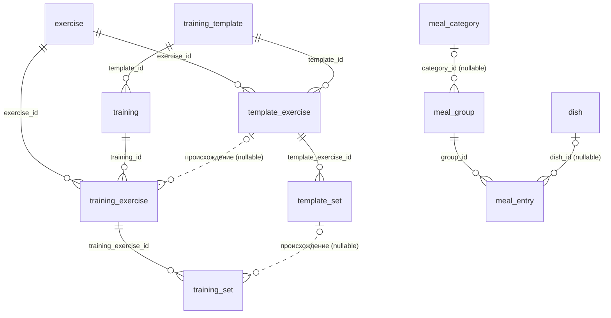

# SimpleSport — бизнес-план и функциональная спецификация

> Статус: рабочий документ. Версия 1.4. Область: полное описание продукта — модель данных, экраны, user stories,
> сценарии, формулы расчётов, этапы реализации. Рабочая очередь задач по этому плану — [BACKLOG.md](./BACKLOG.md).
>
> **Изменения в 1.4.** Закрыты все вопросы, блокировавшие начало работ.
>
> 1. **Норма питания версионируется по датам.** Таблица `nutrition_goal` с `effective_from`, ступенчатая линия плана на
>    графике, каждый день считается по действовавшей тогда норме. Ключи `goal.*` уходят из `app_kv`. Затронуты Р-3, 4.1,
>    4.2, 4.5, 4.6, 6.3, 8.3, 8.4, 8.6, US-1.1, US-8.1, US-9.5, US-10.3.
> 2. **Разведены календарная дата и момент времени.** Новое решение Р-8: даты плавающие, без пояса; `created_at` и
>    прочие отметки — UTC; «сегодня» считается только через `todayLocal()`.
> 3. **US-1.5 приведён в соответствие с разделом 8.** Список сервисов по таблицам противоречил репозиториям по
>    агрегатам. Теперь 8.6 — единственный нормативный источник по API, US-1.5 содержит критерии приёмки. В 8.6 добавлены
>    полный инвентарь из 52 методов, границы репозитория (чистые вычисления снаружи, производные значения в сторе,
>    кросс-агрегатные записи у владельца главного агрегата), порядок поставки по эпикам и правила по моделям.
> 4. **Пустые состояния.** Новый раздел 7.1: три вида пустоты и плейсхолдеры по всем экранам. Отдельного онбординга не
>    будет.
> 5. **Архивация шаблонов** описана по правилам блюд и упражнений, с пометкой в тренировках, созданных из архивного
>    шаблона (US-7.1).
> 6. **Перетаскивание тренировок внутри дня** (US-2.3).
> 7. **Флаг `is_warmup` отклонён окончательно** (Р-2), **механизм миграций снят с повестки** до появления ценных данных
>    (Р-4).
>
> **Изменения в 1.3.** Добавлен раздел 8 — технический контракт по состоянию и доступу к данным: три уровня сторов, шина
> ревизий для автоматической синхронизации между экранами, шесть репозиториев по агрегатам вместо потабличного CRUD,
> транзакции. Зафиксированы правила изменения ядра `libs/shared`. Разделы 19–21 перенумерованы в 20–22, переработан
> Этап 1.
>
> **Изменения в 1.2.**
>
> 1. **Выполненность переехала на подход.** `training_exercise.done` удалён, добавлен `training_set.done`. Состояние
>    упражнения и тренировки вычисляется. В аналитику попадают только выполненные подходы. Затронуты разделы 4.3, 6,
>    US-1.2, US-1.5, US-2.3, US-2.4, US-3.5, US-9.7.
> 2. **Синхронизация шаблона — дельта вместо полной замены.** Введено происхождение записей (`source_template_*_id`),
>    синхронизация применяет адресные идемпотентные операции и не стирает ручные правки. Цели — дни `>= сегодня`.
>    Затронуты разделы 4.4, US-1.5, US-7.3, US-7.4.
> 3. **Гибкий выбор периода в аналитике.** Пресеты и ручной ввод дат сосуществуют на экране, добавлены открытые границы
>    и сдвиг окна. Затронут US-9.1.
>
> **Изменения в 1.1.** Трекер калорий переведён на мягкие справочники (решение Р-7): предзаполненных категорий больше
> нет, группы приёмов пищи создаются внутри дня в один клик, названия групп и блюда можно записывать разово, без
> сохранения в справочник. Затронуты разделы 2, 3, 4, 6, 7, эпик 8 целиком, US-1.5, US-9.6, US-10.5, US-10.6, US-10.7.

---

## Содержание

1. [Продукт](#1-продукт)
2. [Глоссарий](#2-глоссарий)
3. [Принятые решения по архитектуре](#3-принятые-решения-по-архитектуре)
4. [Модель данных](#4-модель-данных)
5. [Единицы измерения и форматирование](#5-единицы-измерения-и-форматирование)
6. [Формулы расчётов](#6-формулы-расчётов)
7. [Карта экранов и навигация](#7-карта-экранов-и-навигация)
8. [Архитектура состояния и доступа к данным](#8-архитектура-состояния-и-доступа-к-данным)
9. [Эпик 1. Фундамент: модель данных](#эпик-1-фундамент-модель-данных)
10. [Эпик 2. Лента тренировок (главный экран)](#эпик-2-лента-тренировок-главный-экран)
11. [Эпик 3. Создание и редактирование тренировки](#эпик-3-создание-и-редактирование-тренировки)
12. [Эпик 4. Заметки](#эпик-4-заметки)
13. [Эпик 5. Фильтрация ленты](#эпик-5-фильтрация-ленты)
14. [Эпик 6. Планировщик — календарь](#эпик-6-планировщик--календарь)
15. [Эпик 7. Шаблоны тренировок](#эпик-7-шаблоны-тренировок)
16. [Эпик 8. Трекер калорий](#эпик-8-трекер-калорий)
17. [Эпик 9. Аналитика и графики](#эпик-9-аналитика-и-графики)
18. [Эпик 10. Настройки и справочники](#эпик-10-настройки-и-справочники)
19. [Эпик 11. Таймер и секундомер](#эпик-11-таймер-и-секундомер)
20. [Нефункциональные требования](#20-нефункциональные-требования)
21. [Этапы реализации](#21-этапы-реализации)
22. [Открытые вопросы](#22-открытые-вопросы)

---

## 1. Продукт

### 1.1 Что это

SimpleSport — офлайн-first мобильное приложение (Angular + Capacitor, SQLite на устройстве) для самостоятельного ведения
дневника тренировок и питания.

### 1.2 Целевой пользователь

Человек, который тренируется сам или по программе от тренера, ведёт записи регулярно и хочет видеть динамику. Не
соревнующийся спортсмен, но и не новичок: понимает, что такое подход, повтор и рабочий вес.

### 1.3 Ключевые принципы

| Принцип                         | Что это значит на практике                                                                                  |
| ------------------------------- | ----------------------------------------------------------------------------------------------------------- |
| **Скорость ввода**              | Запись подхода в зале — 2–3 тапа. Никаких обязательных полей сверх необходимого.                            |
| **Офлайн-first**                | Всё работает без сети. Синхронизация с сервером — вне текущего скоупа.                                      |
| **Ничего не теряется**          | Удаление — мягкое. Архивация справочников не ломает историю.                                                |
| **История неизменна**           | Изменение справочника или шаблона не переписывает прошлые записи задним числом.                             |
| **Одна модалка вместо экранов** | Создание сущностей «на лету» без потери контекста.                                                          |
| **Справочник — не обязанность** | В питании можно записать что угодно, ничего предварительно не заводя. Порядок наводится потом и по желанию. |

### 1.4 Вне скоупа версии 1.0

- Аккаунты, облачная синхронизация, шеринг тренировок
- Интеграции с носимыми устройствами и HealthKit / Google Fit
- Штрихкод-сканер продуктов и онлайн-база блюд
- Социальные функции, лента друзей
- Экспорт/импорт данных (кандидат на 1.1)

---

## 2. Глоссарий

| Термин                                          | Определение                                                                                                                                                                          |
| ----------------------------------------------- | ------------------------------------------------------------------------------------------------------------------------------------------------------------------------------------ |
| **День**                                        | Плавающая календарная дата `'YYYY-MM-DD'` без часового пояса. Ключ группировки всей ленты и аналитики. Не момент времени: при смене пояса прошлые дни остаются на своих датах (Р-8). |
| **Тренировка** (`training`)                     | Одна сессия в конкретный день. В одном дне может быть несколько тренировок.                                                                                                          |
| **Упражнение справочника** (`exercise`)         | Именованная запись в каталоге: «Жим лёжа», «Бег», «Растяжка спины». Имеет тип.                                                                                                       |
| **Упражнение тренировки** (`training_exercise`) | Вхождение упражнения справочника в конкретную тренировку. Носитель заметки. Собственного флага «выполнено» не имеет — состояние вычисляется из подходов.                             |
| **Подход** (`training_set`)                     | Одна строка метрик внутри упражнения тренировки. Отдельная запись со своим весом, повторами и флагом выполнения.                                                                     |
| **Тоннаж**                                      | Σ(вес × повторы) по всем силовым подходам. Единица — кг.                                                                                                                             |
| **План**                                        | Целевые значения (`planned_*`), заданные заранее — вручную или из шаблона.                                                                                                           |
| **Факт**                                        | Фактически выполненные значения.                                                                                                                                                     |
| **Шаблон** (`training_template`)                | Заготовка тренировки: состав упражнений и плановых подходов.                                                                                                                         |
| **Архивация**                                   | Скрытие элемента справочника из поиска при создании новых записей. Исторические записи сохраняются.                                                                                  |
| **Мягкое удаление**                             | `deleted = 1`. Запись исчезает из всех выборок, но физически остаётся.                                                                                                               |
| **Группа приёмов пищи** (`meal_group`)          | Раздел внутри дня питания. Существует только в своём дне. Может ссылаться на категорию справочника, иметь разовое имя или быть безымянной.                                           |
| **Категория** (`meal_category`)                 | Необязательная запись справочника, к которой можно привязать группу, чтобы переиспользовать название между днями.                                                                    |
| **Разовая запись**                              | Блюдо или название группы, введённые без сохранения в справочник. Живут внутри своей записи и доступны для повторного выбора через историю.                                          |
| **Снимок**                                      | Значения (название, калории, БЖУ), скопированные в запись в момент создания. Последующая правка справочника их не меняет.                                                            |
| **Выполненный подход**                          | Подход с `done = 1`. Единственная единица учёта в аналитике тренировок.                                                                                                              |
| **Происхождение**                               | Ссылка записи тренировки на элемент шаблона, из которого она создана. Основа адресной синхронизации.                                                                                 |
| **Дельта шаблона**                              | Набор операций (добавлено, удалено, изменено), вычисленный между состоянием шаблона до и после правки. Считается чистой функцией `templateDiff` вне слоя доступа к данным.           |
| **Версия нормы** (`nutrition_goal`)             | Запись «с такой-то даты норма такая». Действующая на день норма — последняя версия не позже этого дня.                                                                               |
| **Репозиторий**                                 | Единственная точка доступа к данным одного агрегата. Возвращает собранные модели, пишет транзакциями, бампает ревизии после `COMMIT`.                                                |

---

## 3. Принятые решения по архитектуре

Решения зафиксированы; изменение любого из них требует пересмотра модели данных.

### Р-1. Подход — отдельная запись

Каждый подход хранится строкой в `training_set` со своим весом и повторами. Пять подходов = пять строк.

**Следствия:** поддерживаются пирамида, дропсеты и разный вес в подходах. Тоннаж считается как `SUM(weight * reps)`, а
не как произведение с количеством подходов. Ввод одинаковых подходов упрощается через кнопку «Повторить подход»
(копирует предыдущую строку).

### Р-2. Три типа упражнений

`strength` (силовое), `cardio` (кардио), `stretching` (растяжка / разминка).

**Следствия:** разминка не имеет собственного типа и собственной пометки — она моделируется как упражнение типа
`stretching`. Тип `stretching` полностью исключён из аналитики.

> ⚠️ **Осознанный компромисс, принят окончательно.** Разминочный подход в силовом упражнении (пустой гриф) или
> разминочный бег на дорожке попадут в аналитику как обычные силовые и кардио данные. Флаг `is_warmup` на уровне подхода
> **не вводится**: он усложнил бы ввод ради точности, которая на графике за месяц не видна. Решение закрыто, к нему не
> возвращаемся (бывший ОВ-4).

### Р-3. Нормы питания задаются вручную и версионируются по датам

Суточная норма ккал, белков, жиров и углеводов вводится пользователем в настройках. Автоматический расчёт по
антропометрии не реализуется.

Изменение нормы не правит прежнее значение, а **добавляет новую строку** в `nutrition_goal` с датой вступления в силу.
Действующая на дату норма — последняя запись с `effective_from <= дата`. Версионирование намеренно примитивное: ни
интервалов, ни дат окончания, ни перекрытий — только упорядоченный список «с такого-то числа норма такая».

**Следствия:** нет сущности «профиль пользователя». Линия «План» на графике калорий **ступенчатая**, а не
горизонтальная: видно и как менялась планка, и как факт следовал за ней. Прошлое при смене нормы не перерисовывается. До
первой заданной нормы плана не существует, и на этом участке линия не рисуется.

### Р-4. Схема пересоздаётся, миграций нет

Приложение не в проде, накопленные данные не представляют ценности. В `app_kv` хранится `schema_version`; при
несовпадении с версией в коде все доменные таблицы удаляются и создаются заново.

**Следствия:** нельзя выкатывать сборки пользователям до фиксации схемы. Механизм инкрементальных миграций в версию 1.0
не входит: пока база пуста, терять нечего. Он появится тогда, когда появятся данные, которые жалко потерять, — и это
будет отдельная работа со своим планом, а не пункт текущего скоупа.

### Р-5. Все величины в БД — метрические, в базовых единицах СИ

| Величина       | Единица в БД | Тип колонки |
| -------------- | ------------ | ----------- |
| Вес            | килограмм    | `REAL`      |
| Расстояние     | **метр**     | `REAL`      |
| Длительность   | **секунда**  | `INTEGER`   |
| Масса продукта | грамм        | `REAL`      |
| Энергия        | килокалория  | `REAL`      |
| БЖУ            | грамм        | `REAL`      |

Конвертация в фунты, мили, километры и килоджоули выполняется исключительно на уровне отображения.

### Р-6. Метрики подхода — одна таблица с nullable-колонками

Вместо `training_exercise_strength` и `training_exercise_cardio` вводится единая `training_set`. Заполненность колонок
определяется типом упражнения и контролируется `CHECK`-ограничением.

**Обоснование:** агрегаты для аналитики (тоннаж по дню, дистанция по дню) считаются одним `SUM` без `UNION` разнородных
таблиц. Цена — часть колонок всегда `NULL`.

### Р-7. Справочники питания — мягкие

Ни категория приёма пищи, ни блюдо не обязаны существовать в справочнике, чтобы пользователь мог что-то записать. Любая
запись допускает три состояния: ссылка на справочник, разовое значение без справочника, отсутствие значения вообще.

| Сущность            | Ссылка на справочник   | Разовое значение                     | Отсутствует                                 |
| ------------------- | ---------------------- | ------------------------------------ | ------------------------------------------- |
| Группа приёмов пищи | `category_id` заполнен | `name` заполнен                      | оба `NULL` — безымянная группа              |
| Запись съеденного   | `dish_id` заполнен     | `dish_id = NULL`, значения на записи | недопустимо: название и калории обязательны |

**Следствия:**

- Предзаполненных категорий «Завтрак / Обед / Ужин» нет. День начинается с одной безымянной группы.
- Справочник наполняется только явным действием пользователя, а не побочным эффектом ввода.
- Поиск при вводе идёт **и по справочнику, и по ранее использованным разовым названиям**. Повторное использование
  работает, даже если пользователь ни разу ничего не сохранил в справочник.
- Запись съеденного хранит **итоговые значения**, а не пересчитывает их из текущего состояния справочника. Правка блюда
  не переписывает историю молча — см. US-10.5.

**Обоснование.** Барьер входа в дневник питания — главная причина, по которой его бросают. Требование «сначала заведи
категорию, потом заведи блюдо, потом запиши» этот барьер создаёт. Мягкие справочники убирают обязательные шаги, но
сохраняют возможность навести порядок позже.

**Область действия.** Только питание. Упражнения остаются жёстким справочником: у них есть тип, определяющий набор полей
и участие в аналитике, поэтому разовое упражнение без записи в справочнике сломало бы графики.

### Р-8. Календарная дата и момент времени — разные типы

В схеме два несовместимых вида временных значений, и обращаться с ними нужно по-разному.

| Вид                  | Поля                                                                                 | Формат                                       | Часовой пояс        |
| -------------------- | ------------------------------------------------------------------------------------ | -------------------------------------------- | ------------------- |
| **Календарная дата** | `training.date`, `meal_group.date`, `day_note.date`, `nutrition_goal.effective_from` | `'YYYY-MM-DD'`                               | нет, плавающая дата |
| **Момент времени**   | `created_at`, `updated_at`, `done_at`                                                | ISO-8601 с `Z`: `'2026-09-07T18:00:00.000Z'` | всегда UTC          |

**Почему дата без пояса.** «Я тренировался 7 сентября» — метка календаря, а не момент. Чтобы перевести её в UTC,
пришлось бы выдумать время суток, и тогда запись, сделанная в 01:00 по UTC+3, уехала бы на предыдущий день. При переезде
в другой пояс прошлые записи начали бы разъезжаться по соседним дням. Плавающая дата от этого защищена: 7 сентября
остаётся 7 сентября в любой точке мира.

**Почему момент в UTC.** Это настоящие мгновения, их сравнивают и сортируют. Локальный формат дал бы неоднозначный час
дважды в год при переводе часов и несравнимые строки после смены пояса.

**Правило вычисления «сегодня».** Текущая дата собирается только из локальных компонент даты, через единственный хелпер
`todayLocal()`. Получение даты как `new Date().toISOString().slice(0, 10)` **запрещено** и выносится в правило линтера:
этот способ отдаёт дату по UTC, из-за чего в UTC+3 после 21:00 приложение перескакивает на завтра и показывает «Сегодня»
пустым будущим днём.

**Следствия:** при перелёте прошлые записи остаются на своих датах, а «сегодня» становится местным днём. Пересечение
линии перемены дат может продублировать или пропустить день — это соответствует тому, что человек действительно прожил,
и специальной обработки не требует. Секундомер и таймер ведут отсчёт от `Date.now()` и часовыми поясами не затрагиваются
вовсе (US-11.3).

---

## 4. Модель данных

### 4.1 ER-диаграмма



`day_note`, `nutrition_goal` и `app_kv` связей не имеют: первые две адресуются календарной датой, третья — строковым
ключом. `nutrition_goal` намеренно не связана с питанием внешним ключом: норма действует на все дни диапазона, а не на
конкретную запись (Р-3).

Пунктирные связи от `template_exercise` и `template_set` — это **происхождение** (раздел 4.4): они помнят, из какого
элемента шаблона создана запись тренировки, и служат адресом для синхронизации.

Обратите внимание на две **необязательные** связи в питании: `meal_group.category_id` и `meal_entry.dish_id` допускают
`NULL`. Это и есть механика мягких справочников (решение Р-7): группа может иметь разовое имя вместо ссылки на
категорию, а запись — собственные значения вместо ссылки на блюдо.

### 4.2 DDL

```sql
-- ============================================================
-- СОГЛАШЕНИЯ ПО ВРЕМЕНИ (решение Р-8)
--   date, effective_from        — 'YYYY-MM-DD', плавающая календарная дата без пояса
--   created_at, updated_at,
--   done_at                     — ISO-8601 в UTC: '2026-09-07T18:00:00.000Z'
-- ============================================================

-- ============================================================
-- СПРАВОЧНИКИ
-- ============================================================

CREATE TABLE exercise (
  id          TEXT    PRIMARY KEY NOT NULL,
  name        TEXT    NOT NULL,
  type        TEXT    NOT NULL CHECK (type IN ('strength', 'cardio', 'stretching')),
  comment     TEXT,
  archived    INTEGER NOT NULL DEFAULT 0,
  deleted     INTEGER NOT NULL DEFAULT 0,
  created_at  TEXT    NOT NULL,
  updated_at  TEXT    NOT NULL
);
CREATE UNIQUE INDEX ux_exercise_name ON exercise (name COLLATE NOCASE) WHERE deleted = 0;

CREATE TABLE dish (
  id                TEXT    PRIMARY KEY NOT NULL,
  name              TEXT    NOT NULL,
  comment           TEXT,
  calories_per_100g REAL    NOT NULL,
  protein_per_100g  REAL    NOT NULL DEFAULT 0,
  fat_per_100g      REAL    NOT NULL DEFAULT 0,
  carbs_per_100g    REAL    NOT NULL DEFAULT 0,
  archived          INTEGER NOT NULL DEFAULT 0,
  deleted           INTEGER NOT NULL DEFAULT 0,
  created_at        TEXT    NOT NULL,
  updated_at        TEXT    NOT NULL
);
CREATE UNIQUE INDEX ux_dish_name ON dish (name COLLATE NOCASE) WHERE deleted = 0;

-- Необязательный справочник категорий. Пустой при первом запуске,
-- наполняется только явным действием пользователя «Создать категорию».
CREATE TABLE meal_category (
  id          TEXT    PRIMARY KEY NOT NULL,
  name        TEXT    NOT NULL,
  archived    INTEGER NOT NULL DEFAULT 0,
  deleted     INTEGER NOT NULL DEFAULT 0,
  created_at  TEXT    NOT NULL,
  updated_at  TEXT    NOT NULL
);
CREATE UNIQUE INDEX ux_meal_category_name ON meal_category (name COLLATE NOCASE) WHERE deleted = 0;

-- ============================================================
-- ТРЕНИРОВКИ
-- ============================================================

CREATE TABLE training (
  id           TEXT    PRIMARY KEY NOT NULL,
  date         TEXT    NOT NULL,               -- 'YYYY-MM-DD', локальная дата
  name         TEXT,
  comment      TEXT,                           -- заметка тренировки
  sort_order   INTEGER NOT NULL DEFAULT 0,     -- порядок внутри дня
  template_id  TEXT    REFERENCES training_template (id),
  deleted      INTEGER NOT NULL DEFAULT 0,
  created_at   TEXT    NOT NULL,
  updated_at   TEXT    NOT NULL
);
CREATE INDEX idx_training_date        ON training (date) WHERE deleted = 0;
CREATE INDEX idx_training_template_id ON training (template_id);

-- Признака `done` здесь НЕТ: выполненность упражнения вычисляется из подходов (US-2.4).
CREATE TABLE training_exercise (
  id           TEXT    PRIMARY KEY NOT NULL,
  training_id  TEXT    NOT NULL REFERENCES training (id),
  exercise_id  TEXT    NOT NULL REFERENCES exercise (id),
  sort_order   INTEGER NOT NULL,
  comment      TEXT,                           -- заметка упражнения

  -- происхождение: из какого элемента шаблона создано упражнение.
  -- NULL = добавлено пользователем вручную, синхронизация шаблона его не трогает (US-7.4)
  source_template_exercise_id TEXT REFERENCES template_exercise (id),

  deleted      INTEGER NOT NULL DEFAULT 0
);
CREATE INDEX idx_training_exercise_training ON training_exercise (training_id) WHERE deleted = 0;
CREATE INDEX idx_training_exercise_exercise ON training_exercise (exercise_id);
CREATE INDEX idx_training_exercise_source   ON training_exercise (source_template_exercise_id);

CREATE TABLE training_set (
  id                    TEXT    PRIMARY KEY NOT NULL,
  training_exercise_id  TEXT    NOT NULL REFERENCES training_exercise (id),
  sort_order            INTEGER NOT NULL,

  -- факт
  weight                REAL,      -- кг,     strength
  reps                  INTEGER,   --         strength
  distance              REAL,      -- метры,  cardio
  duration              INTEGER,   -- секунды, cardio | stretching

  -- план
  planned_weight        REAL,
  planned_reps          INTEGER,
  planned_distance      REAL,
  planned_duration      INTEGER,

  -- выполненность живёт на подходе; только done = 1 попадает в аналитику (раздел 6)
  done                  INTEGER NOT NULL DEFAULT 0,
  done_at               TEXT,

  -- происхождение, см. training_exercise.source_template_exercise_id
  source_template_set_id TEXT REFERENCES template_set (id),

  deleted               INTEGER NOT NULL DEFAULT 0,

  CHECK (weight   IS NULL OR weight   >= 0),
  CHECK (reps     IS NULL OR reps     >= 0),
  CHECK (distance IS NULL OR distance >= 0),
  CHECK (duration IS NULL OR duration >= 0)
);
CREATE INDEX idx_training_set_exercise ON training_set (training_exercise_id) WHERE deleted = 0;
CREATE INDEX idx_training_set_source   ON training_set (source_template_set_id);

CREATE TABLE day_note (
  date       TEXT PRIMARY KEY NOT NULL,        -- 'YYYY-MM-DD'
  text       TEXT NOT NULL,
  updated_at TEXT NOT NULL
);

-- ============================================================
-- ШАБЛОНЫ
-- ============================================================

CREATE TABLE training_template (
  id          TEXT    PRIMARY KEY NOT NULL,
  name        TEXT    NOT NULL,
  comment     TEXT,
  archived    INTEGER NOT NULL DEFAULT 0,
  deleted     INTEGER NOT NULL DEFAULT 0,
  created_at  TEXT    NOT NULL,
  updated_at  TEXT    NOT NULL
);

CREATE TABLE template_exercise (
  id           TEXT    PRIMARY KEY NOT NULL,
  template_id  TEXT    NOT NULL REFERENCES training_template (id),
  exercise_id  TEXT    NOT NULL REFERENCES exercise (id),
  sort_order   INTEGER NOT NULL,
  comment      TEXT,
  deleted      INTEGER NOT NULL DEFAULT 0
);

CREATE TABLE template_set (
  id                    TEXT    PRIMARY KEY NOT NULL,
  template_exercise_id  TEXT    NOT NULL REFERENCES template_exercise (id),
  sort_order            INTEGER NOT NULL,
  planned_weight        REAL,
  planned_reps          INTEGER,
  planned_distance      REAL,
  planned_duration      INTEGER,
  deleted               INTEGER NOT NULL DEFAULT 0
);

-- ============================================================
-- ПИТАНИЕ
-- ============================================================

-- Группа приёмов пищи внутри дня. Создаётся в один клик, живёт только в своём дне.
-- Может ссылаться на справочник (category_id), иметь разовое имя (name) или быть безымянной.
CREATE TABLE meal_group (
  id           TEXT    PRIMARY KEY NOT NULL,
  date         TEXT    NOT NULL,               -- 'YYYY-MM-DD'
  category_id  TEXT    REFERENCES meal_category (id),  -- NULL, если без справочника
  name         TEXT,                           -- разовое название; NULL, если из справочника или безымянная
  sort_order   INTEGER NOT NULL,
  deleted      INTEGER NOT NULL DEFAULT 0,
  created_at   TEXT    NOT NULL,

  -- Имя и ссылка на справочник взаимоисключающи
  CHECK (category_id IS NULL OR name IS NULL)
);
CREATE INDEX idx_meal_group_date ON meal_group (date) WHERE deleted = 0;

-- Запись съеденного. Хранит итоговые значения, а не ссылку на текущее состояние справочника.
CREATE TABLE meal_entry (
  id          TEXT    PRIMARY KEY NOT NULL,
  group_id    TEXT    NOT NULL REFERENCES meal_group (id),
  dish_id     TEXT    REFERENCES dish (id),    -- NULL для разовой записи
  name        TEXT    NOT NULL,                -- снимок названия на момент записи
  grams       REAL    CHECK (grams IS NULL OR grams > 0),  -- NULL, если введён сразу итог за порцию

  -- итоговые значения записи
  calories    REAL    NOT NULL CHECK (calories >= 0),
  protein     REAL    NOT NULL DEFAULT 0,
  fat         REAL    NOT NULL DEFAULT 0,
  carbs       REAL    NOT NULL DEFAULT 0,

  comment     TEXT,
  sort_order  INTEGER NOT NULL,

  -- значения отредактированы после создания; такие записи пропускаются
  -- при пересчёте истории из справочника (US-10.5)
  manually_edited INTEGER NOT NULL DEFAULT 0,

  deleted     INTEGER NOT NULL DEFAULT 0,
  created_at  TEXT    NOT NULL
);
CREATE INDEX idx_meal_entry_group ON meal_entry (group_id) WHERE deleted = 0;
CREATE INDEX idx_meal_entry_dish  ON meal_entry (dish_id);

-- Версии суточной нормы (решение Р-3). Каждая правка нормы — новая строка,
-- прежние никогда не переписываются. Действующая на дату D норма — запись
-- с максимальным effective_from <= D. До самой ранней записи нормы нет.
CREATE TABLE nutrition_goal (
  id             TEXT    PRIMARY KEY NOT NULL,
  effective_from TEXT    NOT NULL,             -- 'YYYY-MM-DD'
  calories       REAL    NOT NULL CHECK (calories >= 0),
  protein        REAL    NOT NULL DEFAULT 0,
  fat            REAL    NOT NULL DEFAULT 0,
  carbs          REAL    NOT NULL DEFAULT 0,
  created_at     TEXT    NOT NULL
);
-- Одна норма на дату: повторное сохранение тем же числом заменяет строку, а не плодит версии
CREATE UNIQUE INDEX ux_nutrition_goal_date ON nutrition_goal (effective_from);

-- ============================================================
-- НАСТРОЙКИ
-- ============================================================

CREATE TABLE app_kv (
  key   TEXT PRIMARY KEY NOT NULL,
  value TEXT
);
```

### 4.3 Вычисляемые состояния

Часть состояний намеренно не хранится, чтобы исключить рассинхрон между уровнями иерархии.

**Выполненность упражнения.** Столбца `training_exercise.done` не существует. Упражнение считается выполненным, когда у
него **есть хотя бы один** неудалённый подход и **все** такие подходы имеют `done = 1`.

```sql
SELECT te.id,
       COUNT(ts.id)                                    AS total_sets,
       COALESCE(SUM(ts.done), 0)                       AS done_sets,
       CASE WHEN COUNT(ts.id) > 0
             AND COUNT(ts.id) = COALESCE(SUM(ts.done), 0)
            THEN 1 ELSE 0 END                          AS done
FROM training_exercise te
LEFT JOIN training_set ts
       ON ts.training_exercise_id = te.id AND ts.deleted = 0
WHERE te.deleted = 0
GROUP BY te.id;
```

Упражнение без подходов **не выполнено** — пустое множество не считается выполненным. Это защищает от того, чтобы только
что добавленная строка сразу выглядела завершённой.

**Выполненность тренировки.** Тренировка выполнена, когда у неё есть хотя бы одно неудалённое упражнение и все они
выполнены по правилу выше.

**Прогресс.** Для отображения «2 / 4» используются `done_sets` и `total_sets` из того же запроса.

### 4.4 Происхождение записей из шаблона

`training_exercise.source_template_exercise_id` и `training_set.source_template_set_id` фиксируют, из какого элемента
шаблона создана запись. Это единственный механизм, по которому синхронизация шаблона (US-7.4) находит свои цели.

| Значение                     | Что означает                                  | Поведение при синхронизации                 |
| ---------------------------- | --------------------------------------------- | ------------------------------------------- |
| Заполнено, запись существует | Создано шаблоном, пользователь не удалял      | Обновляется и удаляется по командам шаблона |
| Заполнено, `deleted = 1`     | Создано шаблоном, пользователь удалил вручную | Пропускается, не воскрешается               |
| `NULL`                       | Добавлено пользователем вручную               | Не трогается никогда                        |

Ключевое свойство: связь по идентификатору, а не по позиции или имени. Благодаря этому применение изменений идемпотентно
— повторный запуск не создаёт дублей, а операция над уже удалённой записью просто ничего не делает.

### 4.5 Что уходит из текущей схемы

| Было                               | Стало                                              | Причина                                                                 |
| ---------------------------------- | -------------------------------------------------- | ----------------------------------------------------------------------- |
| `training_exercise_strength` (1:1) | `training_set`                                     | Нужны множественные подходы                                             |
| `training_exercise_cardio` (1:1)   | `training_set`                                     | То же + унификация агрегатов                                            |
| `meal` + `meal_item`               | `meal_group` + `meal_entry`                        | Приём пищи — это группа внутри дня, а не самостоятельная сущность       |
| Обязательный `meal_item.dish_id`   | `meal_entry.dish_id` nullable + значения на записи | Р-7: блюдо можно записать разово, не заводя в справочнике               |
| Расчёт калорий из `dish` на лету   | Итоговые значения в `meal_entry`                   | Р-7: история не переписывается при правке справочника                   |
| `training.date_time`               | `training.date` + `sort_order`                     | Группировка по дню — единственный сценарий; время суток не используется |
| `deleted` как признак архива       | `archived` + `deleted` раздельно                   | Архивация и удаление — разные операции с разной семантикой              |
| Дистанция в километрах             | Дистанция в метрах                                 | Р-5                                                                     |
| `training_exercise.done`           | `training_set.done` + вычисление                   | Отмечается подход, а не упражнение (US-2.4)                             |
| Ключи `goal.*` в `app_kv`          | Таблица `nutrition_goal`                           | Р-3: норма версионируется по датам, ключ-значение этого не выражает     |

### 4.6 Ключи `app_kv`

| Ключ                      | Тип значения                    | По умолчанию             |
| ------------------------- | ------------------------------- | ------------------------ |
| `schema_version`          | число                           | текущая версия из кода   |
| `settings.language`       | `'ru' \| 'en'`                  | язык системы, иначе `ru` |
| `settings.theme`          | `'light' \| 'dark' \| 'system'` | `system`                 |
| `settings.units.weight`   | `'kg' \| 'lb'`                  | `kg`                     |
| `settings.units.distance` | `'m' \| 'km' \| 'mi'`           | `km`                     |
| `settings.units.energy`   | `'kcal' \| 'kj'`                | `kcal`                   |
| `ui.feed.filters`         | JSON                            | пусто                    |

Нормы калорий и БЖУ здесь **не хранятся**: они версионируются по датам и живут в таблице `nutrition_goal` (Р-3).

### 4.7 Стартовые данные (seed)

**Seed отсутствует полностью.** Все справочники — упражнения, блюда, категории приёмов пищи — создаются пустыми и
наполняются пользователем по ходу работы.

Отдельно отмечу: предзаполненных категорий «Завтрак / Обед / Ужин» **нет** (решение Р-7). Первая запись дня попадает в
автоматически созданную безымянную группу.

---

## 5. Единицы измерения и форматирование

### 5.1 Правила конвертации

| Настройка       | Отображение | Коэффициент от базовой единицы |
| --------------- | ----------- | ------------------------------ |
| Масса `kg`      | `52,5 кг`   | ×1                             |
| Масса `lb`      | `115,7 lb`  | ×2,2046226218                  |
| Расстояние `m`  | `1500 м`    | ×1                             |
| Расстояние `km` | `1,50 км`   | ÷1000                          |
| Расстояние `mi` | `0,93 mi`   | ÷1609,344                      |
| Энергия `kcal`  | `1850 ккал` | ×1                             |
| Энергия `kj`    | `7741 кДж`  | ×4,184                         |

### 5.2 Точность

| Величина     | Знаков после запятой при вводе        | При отображении               |
| ------------ | ------------------------------------- | ----------------------------- |
| Вес          | 2 (шаг 0,25)                          | 1, незначащий ноль скрывается |
| Расстояние   | 2                                     | 2 для км/миль, 0 для метров   |
| Длительность | ввод в формате `мм:сс` или `чч:мм:сс` | тот же формат                 |
| Калории      | 0                                     | 0                             |
| БЖУ          | 1                                     | 1                             |
| Граммы       | 0                                     | 0                             |

**Правило округления:** в БД пишется значение, конвертированное из введённого без промежуточного округления. Округление
применяется только при рендере. Это исключает дрейф значения при повторных переключениях единиц.

### 5.3 Смена единиц

Смена единицы измерения — операция отображения. Значения в БД не пересчитываются, история не меняется. Пересчитываются
все открытые экраны реактивно.

---

## 6. Формулы расчётов

> **Базовое правило отбора.** Во всех расчётах разделов 6.1 и 6.2 участвуют **только подходы с `done = 1`**.
> Запланированный, но не отмеченный подход в аналитику не попадает, даже если его фактические поля заполнены.
> Обоснование и защита от пустых графиков — в US-9.7.

### 6.1 Силовые

| Показатель          | Формула                                                      | Единица |
| ------------------- | ------------------------------------------------------------ | ------- |
| Тоннаж подхода      | `weight × reps`                                              | кг      |
| Тоннаж упражнения   | `Σ` по выполненным подходам упражнения                       | кг      |
| Тоннаж дня          | `Σ` по всем выполненным силовым подходам всех тренировок дня | кг      |
| Повторы дня         | `Σ reps` по выполненным силовым подходам дня                 | шт.     |
| Количество подходов | `COUNT` выполненных подходов с непустыми `reps`              | шт.     |

`NULL` в `weight` или `reps` даёт нулевой вклад в тоннаж, но подход с заполненными `reps` и пустым `weight` (упражнение
с собственным весом) всё равно учитывается в счётчике повторов.

### 6.2 Кардио

| Показатель    | Формула                              | Единица |
| ------------- | ------------------------------------ | ------- |
| Дистанция дня | `Σ distance` по выполненным подходам | м       |
| Время дня     | `Σ duration` по выполненным подходам | с       |
| Скорость      | `distance / duration × 3,6`          | км/ч    |
| Темп          | `duration / (distance / 1000) / 60`  | мин/км  |

Скорость и темп не хранятся — вычисляются при отображении. При `distance = 0` или `duration = 0` показывается прочерк.

### 6.3 Питание

Итоговые значения записи (`calories`, `protein`, `fat`, `carbs`) **хранятся в `meal_entry`**, а не вычисляются при
каждом чтении. Формулы ниже описывают, как эти значения получаются в момент ввода.

**Ввод «на 100 г»** — основной режим, доступен когда указан вес порции:

| Показатель            | Формула                           |
| --------------------- | --------------------------------- |
| `meal_entry.calories` | `calories_per_100g × grams / 100` |
| `meal_entry.protein`  | `protein_per_100g × grams / 100`  |
| `fat`, `carbs`        | аналогично                        |

Источник значений «на 100 г» — выбранное блюдо справочника либо поля, введённые вручную для разовой записи.

**Ввод «за порцию»** — когда вес неизвестен или не нужен: пользователь вводит итоговые ккал и БЖУ напрямую, `grams`
остаётся `NULL`, значения пишутся как есть.

**Обратный пересчёт.** Если `grams` заполнен, значения на 100 г восстанавливаются как `calories / grams × 100`. Это
нужно только для отображения и повторного редактирования; отдельно они не хранятся, чтобы не расходиться с итогом.

**Агрегаты:**

| Показатель        | Формула                                                                      |
| ----------------- | ---------------------------------------------------------------------------- |
| Факт группы       | `Σ calories` по неудалённым записям группы                                   |
| Факт дня          | `Σ calories` по всем записям всех групп дня                                  |
| Факт БЖУ          | аналогично по `protein`, `fat`, `carbs`                                      |
| Норма на дату `D` | значения записи `nutrition_goal` с максимальным `effective_from <= D`        |
| Остаток           | `норма на дату − факт дня`; если нормы на эту дату нет, остаток не считается |
| Килоджоули        | `ккал × 4,184`                                                               |

**Действующая норма (Р-3).** Норма привязана к дате дня, а не к текущему состоянию настроек. День 3 марта считается по
норме, действовавшей 3 марта, даже если сегодня она другая. За период это выражается одним запросом: к каждому дню
подтягивается последняя версия нормы, не позже этого дня.

```sql
SELECT d.date,
       (SELECT g.calories FROM nutrition_goal g
         WHERE g.effective_from <= d.date
         ORDER BY g.effective_from DESC LIMIT 1) AS goal_calories
FROM days d;
```

Дни раньше самой ранней версии нормы получают `NULL` — для них плана не существует, и это не то же самое, что план,
равный нулю.

**Проверка согласованности:** `protein × 4 + fat × 9 + carbs × 4` должно отличаться от значения калорий не более чем на
15 %. Проверка применяется и при создании блюда в справочнике, и при разовой записи. При превышении показывается
предупреждение, но сохранение не блокируется — пользователь может знать точнее.

**Записи без БЖУ.** Белки, жиры и углеводы по умолчанию равны нулю. Запись «300 ккал» без указания БЖУ полностью
валидна: калории учитываются везде, а в сводке БЖУ рядом с суммой показывается пометка «часть записей без БЖУ», чтобы
недобор не выглядел ошибкой.

### 6.4 Исключения из аналитики

Из всех расчётов раздела 6.1–6.2 полностью исключаются:

- упражнения с типом `stretching`;
- мягко удалённые записи (`deleted = 1`) на любом уровне иерархии;
- подходы с `done = 0`.

---

## 7. Карта экранов и навигация

```
/  →  /workouts

Нижняя навигация (5 табов)
├── /workouts                          Тренировки — лента (главный экран)
│   └── модалка создания/редактирования тренировки
├── /planner                           Планировщик
│   ├── таб «Календарь»
│   └── таб «Шаблоны»
│       └── модалка конструктора шаблона
├── /nutrition                         Калории
│   ├── именование группы на месте (инлайн, без отдельного экрана)
│   └── модалка добавления съеденного
├── /analytics                         Прогресс
│   ├── таб «Тренировки»
│   └── таб «Питание»
└── /settings                          Настройки
    ├── /settings/exercises            Справочник упражнений
    ├── /settings/dishes               Справочник блюд
    ├── /settings/meal-categories      Справочник категорий приёмов пищи
    └── /settings/nutrition-goal       Норма калорий и БЖУ

Вне навигации
└── /timer                             Таймер и секундомер
```

**Изменения относительно текущего кода.** Стартовый маршрут переезжает с `/progress` на `/workouts`. Раздел `/history`
становится главным экраном `/workouts`. Заглушка `/planning` наполняется. Появляются `/settings/dishes`,
`/settings/meal-categories`, `/settings/nutrition-goal`, `/timer`.

### 7.1 Пустые состояния

Seed отсутствует полностью (раздел 4.7), поэтому пустой экран — не редкий крайний случай, а **первое, что видит каждый
новый пользователь**. Отдельного онбординга с обучающими шагами не делаем: его роль выполняют плейсхолдеры на своих
местах.

**Три вида пустоты, и путать их нельзя.**

| Вид                  | Когда                                                      | Что показываем                                                           |
| -------------------- | ---------------------------------------------------------- | ------------------------------------------------------------------------ |
| **Пусто вообще**     | Данных не было ни разу                                     | Одна фраза о том, откуда они возьмутся, и кнопка первого действия        |
| **Пусто по фильтру** | Данные есть, но текущий фильтр или период их не показывает | «Ничего не найдено» и кнопка сброса фильтра                              |
| **Пусто по смыслу**  | День без тренировок в ленте, день без еды                  | Не сообщение об ошибке и не плейсхолдер: обычное состояние с кнопкой «+» |

Разница между первым и вторым принципиальна: предложить «создайте первое упражнение» человеку, у которого их пятьдесят,
но включён фильтр, — значит соврать.

**По экранам**

| Экран                       | Пусто вообще                                                                                                                                                               | Пусто по фильтру                                                                                       |
| --------------------------- | -------------------------------------------------------------------------------------------------------------------------------------------------------------------------- | ------------------------------------------------------------------------------------------------------ |
| Лента `/workouts`           | Дни всё равно рендерятся, в каждом «+». Над блоком «Сегодня» — подсказка «Здесь появятся ваши тренировки, начните с плюса», исчезающая после первой сохранённой тренировки | «За выбранный период нет тренировок под фильтр» и «Сбросить фильтры» (US-5.1)                          |
| Планировщик, «Календарь»    | Сетка дат рисуется всегда; дни без тренировок просто пусты                                                                                                                 | —                                                                                                      |
| Планировщик, «Шаблоны»      | «Шаблон — заготовка тренировки, которую можно разворачивать в любой день» и «Создать шаблон»                                                                               | Переключатель «Показать архивные», если все шаблоны в архиве                                           |
| `/nutrition`, день          | «Ничего не добавлено» и кнопка «Добавить»                                                                                                                                  | —                                                                                                      |
| `/analytics`                | «Данных за период нет» и предложение расширить период                                                                                                                      | Если данных нет именно по выбранному упражнению — сказать это прямо, а не «данных нет» вообще (US-9.2) |
| `/settings/exercises`       | «Справочник пуст. Упражнения добавляются прямо при создании тренировки»                                                                                                    | «Ничего не найдено по запросу»                                                                         |
| `/settings/dishes`          | «Справочник пуст. Блюда можно сохранять при записи съеденного, но это необязательно»                                                                                       | То же                                                                                                  |
| `/settings/meal-categories` | См. US-10.6                                                                                                                                                                | То же                                                                                                  |
| `/settings/nutrition-goal`  | См. US-10.3                                                                                                                                                                | —                                                                                                      |

**Общие правила**

- Плейсхолдер обязан объяснять, откуда возьмутся данные, и давать действие. Голое «Нет данных» не допускается нигде.
- Пустое состояние показывается **только после завершения загрузки**, а не вместо неё. Иначе при каждом старте на долю
  секунды мигает «Ничего не добавлено» — состояние загрузки и состояние пустоты различаются явно.
- Плейсхолдер не занимает весь экран и не отодвигает основное действие: кнопка создания остаётся на своём обычном месте.

Оба справочника питания — вспомогательные экраны для наведения порядка. Работать с приложением, ни разу в них не заходя,
полностью допустимо (Р-7).

---

## 8. Архитектура состояния и доступа к данным

Этот раздел — технический контракт. Всё, что здесь написано, обязательно к соблюдению; отступления обсуждаются отдельно,
а не решаются на месте.

### 8.1 Договор по состоянию

**Всякое состояние живёт в `signalStore`.** Никаких сервисов с полями, `BehaviorSubject`, `ReplaySubject` или ручных
`signal()` в компонентах для чего-либо, кроме локальной верстки. Если данные переживают один тик рендера — это стор.

**Состояние собирается только из фич `@simple-sport/shared`.** Писать `withState` / `withComputed` / `withMethods`
напрямую можно, но всё, что уже покрыто фичей, берётся из фичи. Дублировать логику загрузки, пагинации, индексации или
выбора запрещено.

| Фича                              | Назначение                                                               | Статус                                      |
| --------------------------------- | ------------------------------------------------------------------------ | ------------------------------------------- |
| `withRxResourceState`             | Загрузка одного ресурса, реактивный `requestValue`, `_reload`, `_update` | Основная рабочая лошадка                    |
| `withInfinityScroll`              | Постраничная лента с накоплением                                         | Лента тренировок                            |
| `withEntityIndex`                 | Индекс по идентификатору поверх любого списка                            | Везде, где есть поиск по id                 |
| `withSelectionState`              | Множественный и одиночный выбор                                          | Диалоги, фильтры, состояние «грязных» полей |
| `withDiffChanges`                 | Разница между прошлым и текущим списком                                  | Редактор тренировки                         |
| `withOverview`                    | Классическая пагинация без накопления                                    | Пока не используется, оставлен как есть     |
| `withRxResourceParametrizedState` | Кэш ресурсов по ключу запроса                                            | **Не используется**, см. 8.4                |

#### Правила изменения ядра

Каталог `libs/shared/src/lib/features/` — ядро. Любая правка в нём проходит явное согласование до написания кода. Уже
принятые решения:

| Изменение                                          | Статус          | Обоснование                                                                                                                                                                                                                                                                                            |
| -------------------------------------------------- | --------------- | ------------------------------------------------------------------------------------------------------------------------------------------------------------------------------------------------------------------------------------------------------------------------------------------------------ |
| `refresh()` в `withInfinityScroll`                 | **Согласовано** | `reload()` сбрасывает на первую страницу. Для ленты это значит, что отметка подхода после двух месяцев прокрутки выбрасывает пользователя в сегодня. `refresh()` перезапрашивает уже загруженный объём одним запросом (`offset: 0`, `limit: page × itemsPerPage`) и заменяет массив, не трогая `page`. |
| Новая фича `withDataSync`                          | **Отклонено**   | Привязка к шине ревизий остаётся на уровне приложения. Следствие: каждый читающий стор подмешивает ревизию сам, см. 8.4.                                                                                                                                                                               |
| `invalidate()` в `withRxResourceParametrizedState` | **Отклонено**   | Следствие: фича не используется вовсе. Кэш по ключу без инвалидации отдавал бы устаревшие дни питания и периоды аналитики. Вместо неё — `withRxResourceState` с ревизией в `requestValue`.                                                                                                             |

Существующие 136 тестов на фичи сохраняются. Любое согласованное изменение сопровождается тестами в том же файле.

### 8.2 Три уровня сторов

Страницы **не** лениво загружаются и **не** обязаны переживать навигацию: компоненты остаются одноразовыми и спокойно
разрушаются. Сохранность состояния обеспечивают root-сторы, а не время жизни компонента. Это дешевле, чем
`RouteReuseStrategy`, и не создаёт зависших подписок и удержанного DOM.

| Уровень           | Область видимости             | Что хранит                                                             | Переживает навигацию |
| ----------------- | ----------------------------- | ---------------------------------------------------------------------- | -------------------- |
| **1. Доменный**   | `{ providedIn: 'root' }`      | Данные предметной области. Единственный, кто обращается к репозиториям | Да                   |
| **2. Сессионный** | `{ providedIn: 'root' }`      | UI-состояние экранов: фильтры, скролл, выбранный период, активный таб  | Да                   |
| **3. Экранный**   | `providers: []` на компоненте | Только одноразовое: черновик формы, валидация, состояние диалога       | Нет                  |

**Почему уровни 1 и 2 разделены.** Данные инвалидируются шиной ревизий, UI-состояние — никогда. Смешав их, мы получили
бы сброс фильтров при каждом изменении данных. Кроме того, сессионный уровень персистится в `app_kv`, а доменный — нет.

**Правило зависимостей.** Уровень 3 знает про 1 и 2. Уровень 2 не знает ни про 1, ни про 3. Уровень 1 не знает ни про
кого, кроме репозиториев и шины ревизий. Циклический `inject` между сторами запрещён — именно ради этого существует
шина.

### 8.3 Инвентарь сторов

#### Уровень 1 — доменные

| Стор                    | Владеет                                                                                         | Базовые фичи                             |
| ----------------------- | ----------------------------------------------------------------------------------------------- | ---------------------------------------- |
| `SettingsStore`         | Единицы, тема, язык, а также все версии нормы калорий и БЖУ с производной «действующая сегодня» | `withRxResourceState`                    |
| `ExerciseCatalogStore`  | Справочник упражнений целиком в памяти                                                          | `withRxResourceState`, `withEntityIndex` |
| `NutritionCatalogStore` | Блюда и категории приёмов пищи                                                                  | `withRxResourceState`, `withEntityIndex` |
| `TemplateStore`         | Шаблоны и их состав                                                                             | `withRxResourceState`, `withEntityIndex` |
| `WorkoutFeedStore`      | Лента дней тренировок                                                                           | `withInfinityScroll`, `withEntityIndex`  |
| `NutritionDayStore`     | Один день питания: группы, записи, суммы                                                        | `withRxResourceState`                    |
| `PlannerStore`          | Тренировки видимого месяца или недели                                                           | `withRxResourceState`                    |
| `AnalyticsStore`        | Серии для графиков                                                                              | `withRxResourceState`                    |
| `TimerStore`            | Секундомер и таймер                                                                             | `withState`, `withMethods`               |

`SettingsStore` заменяет нынешние `ThemeStore` и `UnitsStore`: оба читают один `app_kv`, и держать два стора над одной
таблицей незачем.

`TimerStore` обязан быть root по причине, не связанной с сохранением состояния: таймер отдыха должен продолжать идти,
когда пользователь ушёл с экрана таймера обратно в тренировку. Отсчёт ведётся от сохранённой метки `Date.now()`, а не
накоплением тиков (US-11.3).

#### Уровень 2 — сессионные

| Стор               | Хранит                                                                 | Персистится в `app_kv`     |
| ------------------ | ---------------------------------------------------------------------- | -------------------------- |
| `FeedUiStore`      | Фильтры ленты, якорная дата, смещение скролла                          | Фильтры — да, скролл — нет |
| `AnalyticsUiStore` | Период, пресет, выбранное упражнение, активный таб                     | Да                         |
| `NutritionUiStore` | Выбранная дата                                                         | Нет, при запуске — сегодня |
| `PlannerUiStore`   | Активный таб, режим календаря, видимый период, множественный выбор дат | Таб и режим — да           |

Компонент читает сессионный стор в `onInit` и восстанавливает позицию, пишет — по мере изменений. Восстановление скролла
в ленте выполняется после того, как загружен соответствующий диапазон дней, иначе восстанавливать некуда.

#### Уровень 3 — экранные

| Стор                   | Живёт                                        | Владеет                                               |
| ---------------------- | -------------------------------------------- | ----------------------------------------------------- |
| `WorkoutEditorStore`   | Модалка создания и редактирования тренировки | Черновик тренировки, «грязные» поля, ошибки валидации |
| `TemplateEditorStore`  | Модалка конструктора шаблона                 | То же для шаблона                                     |
| `MealEntryDialogStore` | Модалка добавления съеденного                | Поиск, режим ввода, черновик записи                   |

Именно здесь остаются `withSelectionState` и `withDiffChanges` — ровно так, как они уже используются в нынешнем
`WorkoutDetailStore`.

### 8.4 Шина ревизий

Требование «изменил данные в одном месте — подхватилось в остальных» решается счётчиком версий по типам данных. Ни один
стор не знает о существовании других.

#### Домены

```typescript
export const DATA_DOMAIN = {
  Settings: 'settings',
  NutritionGoal: 'nutritionGoal',
  Exercise: 'exercise',
  Training: 'training',
  TrainingSet: 'trainingSet',
  DayNote: 'dayNote',
  Template: 'template',
  Dish: 'dish',
  MealCategory: 'mealCategory',
  MealGroup: 'mealGroup',
  MealEntry: 'mealEntry',
} as const;

export type DataDomain = (typeof DATA_DOMAIN)[keyof typeof DATA_DOMAIN];
```

#### Стор ревизий

```typescript
export const DataRevisionStore = signalStore(
  {providedIn: 'root'},
  withState({
    revisions: {} as Record<DataDomain, number>,
    lastOrigin: undefined as string | undefined,
  }),
  withMethods((store) => ({
    /** Вызывается репозиторием после успешной записи. */
    bump(domains: readonly DataDomain[], origin?: string): void {
      /* ... */
    },

    /** Составной ключ для подстановки в requestValue: '3:7:1'. */
    keyOf(...domains: DataDomain[]): string {
      /* ... */
    },
  })),
);
```

Ключ — строка, а не объект, чтобы `requestValue` сравнивался по значению без `requestEqual`.

#### Кто бампает

**Репозиторий, автоматически, после успешной транзакции.** Не стор. Мимо репозитория запись невозможна, поэтому забыть
бамп нельзя — в отличие от варианта, где это делает вызывающая сторона.

| Метод репозитория                                                  | Домены                                |
| ------------------------------------------------------------------ | ------------------------------------- |
| `ExerciseRepository.save`, `setArchived`, `delete`                 | `Exercise`                            |
| `TrainingRepository.saveTraining`                                  | `Training`, `TrainingSet`, `Exercise` |
| `TrainingRepository.setSetsDone`, `restoreSets`                    | `TrainingSet`                         |
| `TrainingRepository.deleteTrainings`                               | `Training`, `TrainingSet`             |
| `TrainingRepository.reorderTrainings`                              | `Training`                            |
| `TrainingRepository.saveDayNote`                                   | `DayNote`                             |
| `TemplateRepository.saveTemplate`, `setArchived`, `deleteTemplate` | `Template`                            |
| `TemplateRepository.instantiate`, `applySync`, `revertSync`        | `Training`, `TrainingSet`             |
| `NutritionRepository.saveDish`, `setDishArchived`, `deleteDish`    | `Dish`                                |
| `NutritionRepository.propagateDish`, `promoteToDish`               | `Dish`, `MealEntry`                   |
| `NutritionRepository.saveCategory`, `deleteCategory`               | `MealCategory`, `MealGroup`           |
| `NutritionRepository.saveGroup`, `deleteGroup`, `reorderGroups`    | `MealGroup`                           |
| `NutritionRepository.saveEntry`                                    | `MealEntry`, `Dish`                   |
| `NutritionRepository.deleteEntries`, `moveEntries`                 | `MealEntry`                           |
| `SettingsRepository.patch`                                         | `Settings`                            |
| `SettingsRepository.saveGoal`, `deleteGoal`                        | `NutritionGoal`                       |
| `SettingsRepository.clearDomainData`                               | все домены                            |

Методы, создающие вложенную сущность инлайн, бампают оба домена: `saveTraining` — ещё и `Exercise`, если упражнение
создано прямо в модалке, `saveEntry` — ещё и `Dish`.

#### Кто слушает

| Стор                    | Домены                                                                      |
| ----------------------- | --------------------------------------------------------------------------- |
| `SettingsStore`         | `Settings`, `NutritionGoal`                                                 |
| `ExerciseCatalogStore`  | `Exercise`                                                                  |
| `NutritionCatalogStore` | `Dish`, `MealCategory`                                                      |
| `TemplateStore`         | `Template`, `Exercise`                                                      |
| `WorkoutFeedStore`      | `Training`, `TrainingSet`, `Exercise`, `DayNote`                            |
| `NutritionDayStore`     | `MealGroup`, `MealEntry`, `Dish`, `MealCategory`, `NutritionGoal`           |
| `PlannerStore`          | `Training`, `Template`                                                      |
| `AnalyticsStore`        | `TrainingSet`, `Exercise`, `MealEntry`, `Dish`, `NutritionGoal`, `Settings` |

`NutritionGoal` выделен в отдельный домен, а не влит в `Settings`, именно ради этой таблицы: смена нормы обязана
перерисовать графики и сводку дня, а смена темы или языка — нет. В одном домене они бы дёргали аналитику на каждое
переключение темы.

#### Как подключаются читатели

Отдельной фичи для этого нет (решение 8.1), поэтому подключение — на уровне приложения, двумя способами.

**Ресурсные сторы — через `requestValue`.** Работает на существующей фиче без изменений:

```typescript
withRxResourceState({
  name: 'day',
  eager: true,
  requestValue: (store) =>
    `${store._revisions.keyOf('mealGroup', 'mealEntry', 'dish', 'mealCategory')}|${store._ui.date()}`,
  loader: ({store}) => store._nutrition.queryDay(store._ui.date()),
});
```

**Лента — через `effect` и согласованный `refresh()`:**

```typescript
withHooks({
  onInit(store) {
    effect(() => {
      const key = store._revisions.keyOf('training', 'trainingSet', 'exercise', 'dayNote');
      if (key === store._seenRevision()) return;
      if (store._revisions.lastOrigin() === FEED_ORIGIN) return; // см. 8.5
      untracked(() => store.refresh());
    });
  },
});
```

Чтобы это не расползлось копипастой, в `apps/simple-sport/src/app/stores/` заводится пара хелперов — `revisionKey(...)`
и `syncOnRevision(...)`. Это обычные функции приложения, не фичи ядра.

### 8.5 Оптимистичные обновления и подавление самовозбуждения

Отметка подхода в ленте должна срабатывать мгновенно и откатываться по кнопке в Toast (US-2.4). Простой перезапрос здесь
не годится: он даёт задержку на каждом тапе и сбивает ощущение отзывчивости.

**Наложение поверх данных.** `withInfinityScroll` не даёт патчить `items` — и не должен. Вместо этого стор ленты держит
собственное наложение и накладывает его на данные в производном сигнале:

```typescript
(withState({_pendingDone: {} as Record<Guid, boolean>}),
  withProps((store) => ({
    days: computed(() => applyPendingDone(store.items(), store._pendingDone())),
  })));
```

Порядок действий при отметке:

1. Снять снимок затронутых подходов (`id`, `done`, `done_at`, все поля факта) — он нужен для точного отката.
2. Записать наложение — интерфейс меняется мгновенно.
3. Вызвать `TrainingRepository.setSetsDone({ ..., origin: FEED_ORIGIN })`.
4. Репозиторий бампает `TrainingSet` с этим `origin`.
5. Стор ленты видит свой собственный `origin` и **не** перезапрашивает.
6. Показать Toast. По «Отменить» — `restoreSets(snapshot)` и откат наложения.
7. Наложение очищается при следующем настоящем `refresh()`.

**Область подавления.** Подавление по `origin` применяется только к читателям на `effect`, то есть фактически только к
ленте. Сторы на `requestValue` перезапрашиваются всегда: их выборки маленькие (справочник, один день питания, один месяц
календаря), и усложнять ради них не стоит.

### 8.6 Репозитории

Нынешние восемь CRUD-сервисов по таблицам, три `*-sql.service.ts` и около 57 SQL-шаблонов заменяются шестью
репозиториями **по агрегатам**. Потаблично-CRUD слой удаляется целиком, а не прячется под репозиториями.

#### Принципы

1. **Один метод на форму результата, а не на задачу.** Вместо `listDays`, `listSetsByTrainingId`, `listAllNames`,
   `countTrainingsOnDay` — три метода чтения с общим объектом фильтра.
2. **Вся вариативность — в объекте фильтра.** Новый экран не добавляет метод, он добавляет поле в фильтр.
3. **Чтение возвращает собранную модель.** Репозиторий отдаёт дерево День → Тренировка → Упражнение → Подход, а не
   плоскую проекцию, которую вызывающий собирает сам.
4. **Запись — крупная и транзакционная.** Стор отдаёт желаемое состояние агрегата, репозиторий сам вычисляет разницу с
   текущим и пишет одной транзакцией.
5. **Никакой сборки SQL из строк.** Условия собираются типизированным построителем.

#### Границы репозитория

Три правила о том, что в репозиторий **не** попадает. Без них слой доступа к данным собирает на себя логику, которую
потом невозможно протестировать без базы.

**Чистые вычисления живут снаружи.** Сравнение двух версий шаблона и построение списка операций (US-7.4) — не доступ к
данным, а самая сложная логика приложения. В методе репозитория её не протестировать без SQLite. Разделяем:

```typescript
// чистая функция, юнит-тесты без базы
templateDiff(before: TemplateFull, after: TemplateFull): TemplateDelta;

// репозиторий: читает цели, проверяет применимость, пишет транзакцией
TemplateRepository.previewApply(delta, trainingIds): Observable<SyncPreview>;
TemplateRepository.applySync(delta, trainingIds): Observable<SyncOperationLog>;
```

То же касается проверки согласованности БЖУ (раздел 6.3), нормализации названий для группировки в pie-chart (US-9.6) и
конвертации единиц (раздел 5): всё это чистые функции в `libs/shared`, а не методы репозитория.

**Производные значения считаются там, где живут данные.** Правило: если величина показывается рядом с данными, которые
уже загружены в стор, она вычисляется в `computed()`; SQL-агрегаты — только для диапазонов шире загруженного.

| Величина                                   | Где считается      | Почему                                                                                                                                                                         |
| ------------------------------------------ | ------------------ | ------------------------------------------------------------------------------------------------------------------------------------------------------------------------------ |
| `done`, `doneSets`, `totalSets` упражнения | Стор, `computed()` | Оптимистичное наложение меняет отметку подхода в памяти (8.5). Приехавшая из SQL свёртка не пересчитается, и галочка на подходе встанет, а «упражнение выполнено» не загорится |
| Тоннаж дня в ленте                         | Стор, `computed()` | Подходы этого дня уже в памяти, и число обязано меняться синхронно с отметкой                                                                                                  |
| Тоннаж по дням за 90 дней                  | SQL                | В память такой объём не тянем                                                                                                                                                  |
| Суммы дня в питании                        | Стор, `computed()` | Один день целиком загружен                                                                                                                                                     |
| Разбивка рациона за период                 | SQL                | То же, что тоннаж за период                                                                                                                                                    |

Фильтрация по `done` в запросе при этом остаётся и правилу не противоречит: отобрать строки — не то же самое, что
спроецировать свёртку.

**Атомарная операция через два агрегата принадлежит владельцу главного.** US-3.3 разрешает создать упражнение прямо в
модалке тренировки, US-8.6 — создать блюдо прямо при добавлении съеденного. Два вызова в два репозитория дадут две
транзакции и возможность записать тренировку со ссылкой на упражнение, которое не создалось. Поэтому:

```typescript
// упражнения, которых ещё нет в справочнике, приезжают внутри входа
TrainingRepository.saveTraining(input); // одна транзакция, бампает Training, TrainingSet, Exercise
NutritionRepository.saveEntry(input); // одна транзакция, бампает MealEntry и, если нужно, Dish
```

Владелец главного агрегата создаёт вложенную сущность сам и бампает оба домена.

#### Состав

| Репозиторий           | Агрегат                                      | Методов |
| --------------------- | -------------------------------------------- | ------- |
| `SettingsRepository`  | `app_kv`, версии нормы питания               | 6       |
| `ExerciseRepository`  | Справочник упражнений                        | 4       |
| `TrainingRepository`  | Тренировки, упражнения, подходы, заметки дня | 10      |
| `TemplateRepository`  | Шаблоны, развёртывание, синхронизация        | 10      |
| `NutritionRepository` | Блюда, категории, группы, записи             | 17      |
| `AnalyticsRepository` | Только чтение агрегатов                      | 5       |

Пятьдесят два метода против нынешних пятидесяти семи SQL-шаблонов — при том, что покрытие вырастает на шаблоны,
планировщик, группы питания, БЖУ и версионирование нормы, которых сейчас нет вовсе.

#### Полный инвентарь

Этот список нормативен: он и есть контракт слоя доступа к данным. US-1.5 на него ссылается и не дублирует.

**`SettingsRepository`**

```typescript
getSettings(): Observable<AppSettings>;                  // все ключи app_kv одним чтением
patch(partial: Partial<AppSettings>): Observable<void>;
listGoals(): Observable<NutritionGoalVersion[]>;         // все версии нормы, по убыванию даты
saveGoal(input: NutritionGoalInput): Observable<void>;   // upsert по effective_from (Р-3)
deleteGoal(id: Guid): Observable<void>;
clearDomainData(): Observable<void>;                     // US-10.7, одной транзакцией
```

**`ExerciseRepository`**

```typescript
interface ExerciseQuery {
  search?: string;
  types?: ExerciseType[];
  includeArchived?: boolean;
  withUsage?: boolean;        // количество использований и дата последнего
}

query(q: ExerciseQuery): Observable<ExerciseWithUsage[]>;
save(input: ExerciseSaveInput): Observable<Exercise>;    // создание и правка — один метод
setArchived(ids: Guid[], archived: boolean): Observable<void>;
delete(id: Guid): Observable<void>;                      // отказ, если есть использования
```

Отдельного `isUsed` нет: это флаг `withUsage` в фильтре. Отдельного `search` нет: это поле фильтра. Так работает
принцип 2.

**`TrainingRepository`**

```typescript
// чтение
queryDays(q: TrainingQuery): Observable<PagedResult<TrainingDay>>;
queryTrainings(q: TrainingQuery): Observable<TrainingSummary[]>;
getTraining(id: Guid): Observable<TrainingFull | undefined>;
getLastSetsFor(exerciseId: Guid): Observable<TrainingSetSnapshot[]>;  // предзаполнение, US-3.5

// запись
saveTraining(input: TrainingSaveInput): Observable<TrainingFull>;
setSetsDone(input: SetsDoneInput): Observable<TrainingSetSnapshot[]>;
restoreSets(snapshots: TrainingSetSnapshot[], origin?: string): Observable<void>;
deleteTrainings(ids: Guid[]): Observable<void>;
reorderTrainings(date: string, orderedIds: Guid[]): Observable<void>;  // US-2.3
saveDayNote(date: string, text: string): Observable<void>;             // пустой текст = удаление
```

**`TemplateRepository`**

```typescript
// чтение
queryTemplates(q: TemplateQuery): Observable<TemplateSummary[]>;
getTemplate(id: Guid): Observable<TemplateFull | undefined>;

// запись
saveTemplate(input: TemplateSaveInput): Observable<TemplateFull>;
setArchived(id: Guid, archived: boolean): Observable<void>;
deleteTemplate(id: Guid): Observable<void>;
instantiate(templateId: Guid, dates: string[]): Observable<Guid[]>;    // массив покрывает и US-6.3

// синхронизация; сама дельта считается чистой функцией снаружи
findSyncTargets(templateId: Guid, fromDate: string): Observable<SyncTarget[]>;
previewApply(delta: TemplateDelta, trainingIds: Guid[]): Observable<SyncPreview>;
applySync(delta: TemplateDelta, trainingIds: Guid[]): Observable<SyncOperationLog>;
revertSync(log: SyncOperationLog): Observable<void>;
```

**`NutritionRepository`**

```typescript
// чтение
queryDay(date: string): Observable<NutritionDay>;        // группы, записи, суммы, действующая норма
queryDishes(q: DishQuery): Observable<DishWithUsage[]>;
queryCategories(q: CategoryQuery): Observable<MealCategoryWithUsage[]>;
suggest(q: SuggestQuery): Observable<Suggestion[]>;      // справочник + история разовых (Р-7)

// блюда
saveDish(input: DishSaveInput): Observable<Dish>;
setDishArchived(id: Guid, archived: boolean): Observable<void>;
deleteDish(id: Guid): Observable<void>;
propagateDish(id: Guid): Observable<MealEntrySnapshot[]>;  // пересчёт истории, US-10.5

// категории
saveCategory(input: CategorySaveInput): Observable<MealCategory>;
deleteCategory(id: Guid, mode: 'archive' | 'delete'): Observable<void>;

// группы
saveGroup(input: MealGroupSaveInput): Observable<MealGroup>;  // создание, именование, привязка, разыменование
deleteGroup(id: Guid, opts: { moveEntriesTo?: Guid }): Observable<void>;
reorderGroups(date: string, orderedIds: Guid[]): Observable<void>;

// записи
saveEntry(input: MealEntrySaveInput): Observable<MealEntry>;  // с инлайн-созданием блюда
deleteEntries(ids: Guid[]): Observable<MealEntrySnapshot[]>;
moveEntries(ids: Guid[], groupId: Guid, orderedIds?: Guid[]): Observable<void>;
promoteToDish(entryId: Guid): Observable<Dish>;               // US-8.7
```

Все методы, возвращающие `Snapshot[]`, делают это ради отката через Toast: без снимка прежнего состояния точная отмена
невозможна.

**`AnalyticsRepository`** — только чтение, ни одной записи.

```typescript
interface AnalyticsQuery {
  from: string;                       // 'YYYY-MM-DD'
  to: string;
  exerciseId?: Guid;
  bucket: 'day' | 'week';             // агрегация при длинном диапазоне, US-9.1
}

strengthSeries(q: AnalyticsQuery): Observable<StrengthPoint[]>;
cardioSeries(q: AnalyticsQuery): Observable<CardioPoint[]>;
nutritionSeries(q: AnalyticsQuery): Observable<NutritionPoint[]>;   // факт + норма, действовавшая в этот день
nutritionBreakdown(q: BreakdownQuery): Observable<BreakdownSlice[]>;
exerciseOptions(q: AnalyticsQuery): Observable<ExerciseOption[]>;   // у кого есть данные в периоде, US-9.2
```

#### Порядок поставки

Интерфейсы и модели всех шести репозиториев фиксируются **сразу**, на Этапе 1: принцип «новый экран не добавляет метод,
а добавляет поле в фильтр» работает только тогда, когда заранее известен весь диапазон запросов. Реализация идёт по
эпикам — писать код для питания и аналитики за месяцы до появления первого потребителя незачем и нечем проверять.

| Репозиторий           | Реализуется | Вместе с                                              |
| --------------------- | ----------- | ----------------------------------------------------- |
| `SettingsRepository`  | Этап 1      | Единицы и тема нужны сразу; версии нормы — на Этапе 4 |
| `ExerciseRepository`  | Этап 1      | Эпик 3                                                |
| `TrainingRepository`  | Этап 1      | Эпики 2 и 3                                           |
| `AnalyticsRepository` | Этап 3      | Эпик 9                                                |
| `NutritionRepository` | Этап 4      | Эпик 8                                                |
| `TemplateRepository`  | Этап 5      | Эпики 6 и 7                                           |

Инфраструктура — транзакции (8.7), построитель условий, шина ревизий (8.4) — целиком на Этапе 1: от неё зависят все
шесть.

#### Модели

Модели переписываются вместе со слоем доступа, иначе останется форма под удаляемые CRUD-сервисы.

| Было                                                                                                                                           | Стало                                                                                                        |
| ---------------------------------------------------------------------------------------------------------------------------------------------- | ------------------------------------------------------------------------------------------------------------ |
| Потабличные тройки `Training` / `TrainingCreate` / `TrainingUpdate` в `libs/shared/src/lib/models/`                                            | Модели чтения по агрегатам: `TrainingDay`, `TrainingFull`, `TrainingSummary`, `NutritionDay`, `TemplateFull` |
| Отдельные `*Create` и `*Update` на каждую таблицу                                                                                              | Модели записи по операциям: `TrainingSaveInput`, `MealEntrySaveInput`, `SetsDoneInput`                       |
| `TrainingContract` в `apps/.../models/` со `snake_case` вперемешку и опечатками `weeight`, `plannedRepls`, `arcived`, `reps_count`, `group_id` | Удаляется целиком                                                                                            |

Маппинг `snake_case` → `camelCase` выполняется в одном месте на границе репозитория, а не псевдонимами в каждом запросе.
Именно псевдонимы и разнесли опечатки по всему коду.

#### Пример: чтение тренировок

```typescript
interface TrainingQuery {
  dateFrom?: string;              // 'YYYY-MM-DD'
  dateTo?: string;
  trainingIds?: Guid[];
  templateId?: Guid;
  exerciseIds?: Guid[];
  exerciseTypes?: ExerciseType[];
  includeArchivedExercises?: boolean;
  onlyDoneSets?: boolean;
  includeEmptyDays?: boolean;     // лента показывает дни без тренировок
  page?: { offset: number; limit: number };  // limit — в днях, не в записях
}

queryDays(q: TrainingQuery): Observable<PagedResult<TrainingDay>>;
queryTrainings(q: TrainingQuery): Observable<TrainingSummary[]>;
getTraining(id: Guid): Observable<TrainingFull | undefined>;
```

`queryDays` укладывается в два запроса независимо от размера страницы: первый берёт страницу ключей дней, второй — все
строки этих дней одним `IN`. Дерево собирается в памяти. Этот приём уже применяется в нынешнем `listDays` и сохраняется.

`queryDays` покрывает ленту, `queryTrainings` — календарь и планировщик, `getTraining` — редактор.

#### Пример: запись

```typescript
saveTraining(input: TrainingSaveInput): Observable<TrainingFull>;
setSetsDone(input: {
  setIds: Guid[];
  done: boolean;
  fillFactFromPlan: boolean;
  origin?: string;
}): Observable<TrainingSetSnapshot[]>;
restoreSets(snapshots: TrainingSetSnapshot[], origin?: string): Observable<void>;
```

`setSetsDone` возвращает снимки прежнего состояния — это то, чем питается откат в Toast (US-2.4). Без возврата снимков
точный откат невозможен, потому что отметка могла скопировать план в факт.

#### Построитель условий

```typescript
const {sql, params} = sqlWhere()
  .add('tr.deleted = 0')
  .addIf(q.dateFrom, 'tr.date >= ?', q.dateFrom)
  .addIf(q.dateTo, 'tr.date <= ?', q.dateTo)
  .addIn('te.exercise_id', q.exerciseIds)
  .addIf(q.onlyDoneSets, 'ts.done = 1')
  .build();
```

Значения всегда идут через `?`. Сегодня это в основном соблюдается, но условия по флагам вклеиваются в строку вручную в
нескольких местах — построитель убирает эту неоднородность.

### 8.7 Транзакции

**Транзакций в проекте нет вообще.** В `SqliteStorageService` отсутствуют `transaction`, `beginTransaction`, `commit` и
`rollback`. `saveSets()` пишет через параллельный `forkJoin`, `clearDomainData()` — восемь отдельных `DELETE` подряд.
При ошибке на середине данные остаются в несогласованном состоянии.

Это блокирует половину бизнес-плана: сохранение тренировки целиком, развёртывание шаблона, синхронизацию по дельте,
массовое назначение по календарю, пересчёт истории блюда, откат Toast. Все они по требованиям атомарны.

Добавляется:

```typescript
transaction<T>(work: (tx: SqliteTransaction) => Observable<T>): Observable<T>;
```

Реализация — `BEGIN` / `COMMIT` / `ROLLBACK` на соединении. Вложенные вызовы объединяются в одну внешнюю транзакцию, а
не создают точки сохранения. Все методы записи репозиториев обёрнуты в неё; бамп ревизии выполняется **после** успешного
`COMMIT`, не внутри.

### 8.8 Что удаляется из текущего кода

| Что                                                                       | Почему                                                                           |
| ------------------------------------------------------------------------- | -------------------------------------------------------------------------------- |
| `libs/integration/src/lib/crud/*` — все 8 сервисов                        | Заменяются репозиториями по агрегатам                                            |
| `ExerciseSqlService`                                                      | Passthrough без собственной логики                                               |
| `TrainingSqlService`, `FoodSqlService`                                    | Разбираются в `TrainingRepository`, `NutritionRepository`, `AnalyticsRepository` |
| `ThemeStore`, `UnitsStore`                                                | Сливаются в `SettingsStore`                                                      |
| Локальные копии `cell()` и `placeholders()` в `*-sql.service.ts`          | Дублируют `sqlite.util.ts`                                                       |
| `deletedClause()`                                                         | Заменяется построителем условий                                                  |
| Потабличные модели `*Create` / `*Update` в `libs/shared/src/lib/models/`  | Форма существует ровно под удаляемые CRUD-сервисы                                |
| `apps/.../models/training-contract.model.ts`                              | Смешивает `snake_case` с `camelCase` и содержит все опечатки разом               |
| Опечатки в проекциях: `arcived`, `weeight`, `plannedRepls`, `showArcived` | Утекли в SQL-псевдонимы и модели; при пересоздании схемы исправляются            |

### 8.9 Чеклист соблюдения контракта

- [ ] Состояние объявлено через `signalStore`, а не через поля сервиса или `BehaviorSubject`
- [ ] Использованы фичи из `@simple-sport/shared` там, где они подходят
- [ ] Файлы в `libs/shared/src/lib/features/` не изменены без согласования
- [ ] Стор отнесён к правильному уровню: данные — уровень 1, UI экрана — уровень 2, одноразовое — уровень 3
- [ ] Между сторами нет прямого `inject` ради инвалидации — используется шина ревизий
- [ ] Стор объявил домены, от которых зависит, и подмешал ревизию в `requestValue` или `effect`
- [ ] Обращение к данным идёт только через репозиторий, минуя `SqliteStorageService` напрямую
- [ ] Метод записи обёрнут в транзакцию и бампает ревизию после `COMMIT`
- [ ] Операция, затрагивающая два агрегата, выполнена одним методом владельца главного из них
- [ ] Чистое вычисление вынесено из репозитория в функцию, тестируемую без базы
- [ ] Производное значение считается в сторе, если данные для него уже загружены
- [ ] Значения фильтров передаются через `?`, а не конкатенацией
- [ ] Новый способ выборки добавлен полем в объект фильтра, а не новым методом
- [ ] Деструктивное действие возвращает снимок для отката либо требует подтверждения
- [ ] Календарная дата получена через `todayLocal()`, а не через `toISOString()`
- [ ] У каждого списка и графика есть пустое состояние, и оно отличает «пусто вообще» от «пусто по фильтру»

---

## Эпик 1. Фундамент: модель данных

**Ценность.** Без переработки схемы недостижимы тоннаж, множественные подходы, растяжка, шаблоны и мягкие справочники
питания. Это блокирующий эпик для всех остальных.

**Текущее состояние.** Схема из 8 таблиц создаётся идемпотентными `CREATE TABLE IF NOT EXISTS` в
`libs/integration/src/lib/sqlite-schema.ts`. Версионирования нет. Метрики хранятся в двух таблицах 1:1 с
`training_exercise`.

---

### US-1.1 — Версионирование схемы с пересозданием

**Как** разработчик, **я хочу** чтобы приложение при запуске сверяло версию схемы и пересоздавало БД при несовпадении,
**чтобы** не отлаживать рассинхрон структуры на устройствах.

**Сценарии**

- **Дано** чистое устройство без БД. **Когда** приложение запускается. **Тогда** создаются все таблицы, справочники
  остаются пустыми, в `app_kv.schema_version` пишется текущая версия.
- **Дано** БД с `schema_version = 3`, в коде версия `4`. **Когда** приложение запускается. **Тогда** все доменные
  таблицы удаляются, схема создаётся заново, `app_kv` с настройками пользователя **сохраняется**, `schema_version`
  обновляется.
- **Дано** БД с совпадающей версией. **Когда** приложение запускается. **Тогда** пересоздание не выполняется, данные
  сохраняются.

**Граничные случаи**

- Пересоздание не должно затрагивать ключи `settings.*` — язык, тема и единицы переживают сброс схемы. Версии нормы
  питания живут в доменной таблице `nutrition_goal` и при пересоздании теряются вместе с остальными данными: это четыре
  числа, восстановить их дешевле, чем городить исключение.
- Если пересоздание упало на середине, при следующем запуске `schema_version` остаётся старым и попытка повторяется. Вся
  операция выполняется в транзакции.

---

### US-1.2 — Подход как самостоятельная запись

**Как** пользователь, **я хочу** записывать каждый подход отдельной строкой, **чтобы** фиксировать пирамиду весов и
дропсеты.

**Сценарии**

- **Дано** упражнение «Жим лёжа» в тренировке. **Когда** я добавляю три подхода 60×10, 70×8, 80×6. **Тогда** создаются
  три записи `training_set` с `sort_order` 0, 1, 2.
- **Дано** три подхода. **Когда** я удаляю средний. **Тогда** он помечается `deleted = 1`, а `sort_order` оставшихся
  пересчитывается в 0, 1.
- **Дано** три выполненных подхода. **Когда** запрашивается тоннаж. **Тогда** возвращается `60×10 + 70×8 + 80×6 = 1640`
  кг.
- **Дано** третий подход не отмечен выполненным. **Тогда** тоннаж равен `600 + 560 = 1160` кг.

**Граничные случаи**

- Упражнение без подходов допустимо (например, только что добавленное) и не ломает агрегаты. Выполненным оно при этом не
  считается.
- Подход с `reps = 0` сохраняется — это осмысленная запись «подход не удался». Отмеченный выполненным, он даёт нулевой
  вклад в тоннаж, но учитывается в счётчике подходов.

---

### US-1.3 — Разделение архивации и удаления

**Как** пользователь, **я хочу** чтобы архивация упражнения убирала его из поиска, но не трогала историю, **чтобы**
старые записи оставались читаемыми.

**Сценарии**

- **Дано** упражнение «Жим Смита», использованное в тренировках прошлого года. **Когда** я его архивирую. **Тогда**
  `archived = 1`, в поиске при создании тренировки оно не появляется, а в ленте прошлых дней отображается с пометкой «в
  архиве».
- **Дано** архивное упражнение. **Когда** я открываю справочник и включаю «Показать архивные». **Тогда** оно видно и
  доступно для восстановления.
- **Дано** упражнение, ни разу не использованное. **Когда** я его удаляю. **Тогда** `deleted = 1` и оно исчезает
  отовсюду.
- **Дано** упражнение, использованное хотя бы в одной тренировке. **Когда** я пытаюсь его удалить. **Тогда** вместо
  удаления предлагается архивация с пояснением, что удаление нарушит историю.

---

### US-1.4 — Переход на базовые метрические единицы

**Как** разработчик, **я хочу** хранить расстояние в метрах и длительность в секундах, **чтобы** агрегаты и конвертации
не накапливали ошибку.

**Сценарии**

- **Дано** настройка расстояния «км». **Когда** пользователь вводит `5,2`. **Тогда** в `training_set.distance` пишется
  `5200`.
- **Дано** настройка «мили» и значение в БД `5200`. **Когда** экран рендерится. **Тогда** отображается `3,23 mi`.
- **Дано** пользователь вводит длительность `45:30`. **Тогда** в `duration` пишется `2730`.

---

### US-1.5 — Слой доступа к данным под новую схему

**Как** разработчик, **я хочу** репозитории по агрегатам вместо потабличного CRUD, **чтобы** страницы не собирали SQL
вручную и не теряли согласованность при записи в несколько таблиц.

**Где лежит контракт.** Состав, сигнатуры, порядок поставки и модели шести репозиториев определены в **разделе 8.6** и
здесь намеренно не повторяются. При расхождении правится 8.6, а не эта история. Дублирование списка методов в двух
местах уже один раз привело к тому, что документ противоречил сам себе, — повторять не будем.

**Объём Этапа 1**

1. Инфраструктура: `transaction()` в `SqliteStorageService` (8.7), построитель условий `sqlWhere()`, шина ревизий
   `DataRevisionStore` (8.4).
2. Интерфейсы и модели **всех шести** репозиториев — целиком, без реализации.
3. Реализация трёх: `SettingsRepository`, `ExerciseRepository`, `TrainingRepository`.
4. Удаление legacy-слоя по списку из 8.8.

`TemplateRepository`, `NutritionRepository` и `AnalyticsRepository` реализуются со своими эпиками по таблице поставки в
8.6.

**Критерии приёмки**

- **Дано** запрос `strengthSeries({ from: '2026-01-01', to: '2026-01-31', bucket: 'day' })`. **Тогда** возвращается
  массив по дням с полями `date`, `tonnage`, `reps`, `sets`, без дней без данных.
- **Дано** удалённая тренировка в диапазоне. **Тогда** её данные в агрегат не попадают.
- **Дано** упражнение типа `stretching` в тренировке. **Тогда** оно не влияет ни на `strengthSeries`, ни на
  `cardioSeries`.
- **Дано** `queryDays` со страницей в 20 дней. **Тогда** выполняется ровно два запроса независимо от количества
  тренировок и подходов внутри.
- **Дано** `saveTraining` с упражнением, которого ещё нет в справочнике. **Тогда** упражнение и тренировка создаются
  **одной** транзакцией, и бампаются оба домена.
- **Дано** `saveTraining` прерван ошибкой на середине. **Тогда** в базе не остаётся ни одной строки из этого вызова — ни
  тренировки, ни упражнений, ни подходов.
- **Дано** успешная запись. **Тогда** ревизия бампается **после** `COMMIT`, а не внутри транзакции.
- **Дано** `setSetsDone`. **Тогда** возвращаются снимки прежнего состояния подходов, которых достаточно для точного
  отката через `restoreSets`, включая скопированные из плана значения факта.
- **Дано** любой метод чтения с фильтром. **Тогда** все значения переданы через `?`, и в собранном SQL нет ни одного
  вклеенного значения.
- **Дано** метод чтения тренировок. **Тогда** он **не** возвращает `done`, `doneSets` и `totalSets` как готовые поля
  упражнения: эти величины вычисляются в сторе (правило о производных в 8.6).
- **Дано** дельта шаблона. **Тогда** она вычисляется чистой функцией `templateDiff` вне репозитория и тестируется без
  базы.

**Чем проверяется**

| Что                                                                                                     | Как                                                                                       |
| ------------------------------------------------------------------------------------------------------- | ----------------------------------------------------------------------------------------- |
| Чистые функции: `templateDiff`, проверка согласованности БЖУ, конвертация единиц, нормализация названий | Юнит-тесты без базы                                                                       |
| Репозитории                                                                                             | Интеграционные тесты на in-memory SQLite, по набору на агрегат                            |
| Транзакционность                                                                                        | Тест с намеренной ошибкой в середине записи и проверкой, что состояние базы не изменилось |
| Шина ревизий                                                                                            | Тест, что бамп происходит после `COMMIT` и не происходит при откате                       |

---

## Эпик 2. Лента тренировок (главный экран)

**Ценность.** Основной экран, куда пользователь заходит каждый день. Метафора мессенджера снимает вопрос «где я нахожусь
во времени».

**Текущее состояние.** `apps/simple-sport/src/app/pages/history/` — прямая лента с бесконечным скроллом вниз по 5 дней,
показываются только дни с данными. Требуется разворот направления, порция 20 дней и рендер пустых дней.

---

### US-2.1 — Обратная лента по календарным дням

**Как** пользователь, **я хочу** открывать приложение сразу на сегодняшнем дне и прокручивать вверх в прошлое, **чтобы**
не искать актуальную дату.

**Сценарии**

- **Дано** приложение запущено впервые за сессию. **Когда** открывается `/workouts`. **Тогда** загружаются 20
  календарных дней, заканчивая сегодняшним, и лента проскроллена так, что блок «Сегодня» виден целиком внизу.
- **Дано** лента проскроллена к верхней границе загруженного диапазона. **Когда** я продолжаю тянуть вверх. **Тогда**
  подгружается следующая порция из 20 дней, **позиция скролла визуально не смещается**.
- **Дано** загружены все дни до самой ранней записи в БД. **Когда** я тяну вверх. **Тогда** показывается «Это начало
  истории» и подгрузка прекращается.
- **Дано** в БД нет ни одной записи. **Когда** открывается экран. **Тогда** показываются последние 20 дней, каждый
  пустой, с кнопкой «+».

**Граничные случаи**

- **Сохранение позиции при подгрузке.** Перед вставкой блока измеряется `scrollHeight`, после вставки `scrollTop`
  увеличивается на дельту. Дополнительно на контейнере ставится `overflow-anchor: auto`. Без этого лента «прыгает» — это
  главный источник багов в подобных экранах.
- **Смена суток при открытом приложении.** Если приложение вернулось из фона и локальная дата изменилась, лента
  перезагружается с новым «Сегодня», позиция сбрасывается на низ.
- **Производительность.** При 200+ загруженных днях требуется виртуализация (`cdk-virtual-scroll-viewport` с обратным
  направлением) либо выгрузка блоков сверху. Порог виртуализации — 100 дней.

---

### US-2.2 — Будущие дни в ленте

**Как** пользователь, **я хочу** видеть запланированные тренировки ниже сегодняшнего дня, **чтобы** лента оставалась
единой точкой правды.

**Сценарии**

- **Дано** нет тренировок с датой позже сегодня. **Тогда** «Сегодня» — последний блок ленты, ниже ничего нет.
- **Дано** есть тренировки на будущие даты. **Тогда** ниже «Сегодня» отрисовываются дни вплоть до последней
  запланированной даты, отделённые разделителем «Запланировано».
- **Дано** будущие дни присутствуют. **Когда** экран открывается впервые. **Тогда** скролл всё равно позиционируется на
  «Сегодня», а не в самый низ.

**Граничные случаи**

- Пустые дни между сегодня и последней запланированной датой отображаются как обычные пустые дни.
- Блок будущего дня визуально отличается (приглушённый фон), чтобы не путать план с фактом.

---

### US-2.3 — Состояние дня

**Как** пользователь, **я хочу** одинаково понятный блок для любого дня, **чтобы** быстро оценить, что было сделано.

**Структура блока дня**

```
┌─ 12 марта, четверг ───────────────────────┐
│  📝 Заметка дня (если задана)             │
│                                            │
│  ┌─ Тренировка «Грудь + трицепс»  ✓ ────┐ │
│  │  📝 заметка тренировки               │ │
│  │  ☑ Жим лёжа                     4/4  │ │
│  │  ☑ Разводка гантелей            3/3  │ │
│  │  ⊟ Французский жим              2/4  │ │
│  └───────────────────────────────────────┘ │
│                                            │
│  ┌─ Тренировка «Кардио» ─────────────────┐ │
│  │  ☐ Бег                          0/1  │ │
│  └───────────────────────────────────────┘ │
│                                            │
│                                    [ + ]   │
└────────────────────────────────────────────┘
```

**Сценарии**

- **Дано** день с тренировками. **Тогда** выводится список тренировок; в карточке каждой — **только названия
  упражнений** с чекбоксом и счётчиком подходов, без весов, повторов и дистанций.
- **Дано** упражнение, где выполнены все подходы. **Тогда** чекбокс в состоянии «отмечен», счётчик показывает `4/4`.
- **Дано** упражнение, где выполнена часть подходов. **Тогда** чекбокс в **промежуточном** состоянии, счётчик показывает
  `2/4`.
- **Дано** упражнение, где не выполнен ни один подход. **Тогда** чекбокс пуст, счётчик показывает `0/4`.
- **Дано** упражнение без подходов. **Тогда** чекбокс пуст и **отключён**, вместо счётчика — прочерк.
- **Дано** все упражнения тренировки выполнены. **Тогда** в заголовке карточки появляется галочка.
- **Дано** день без тренировок. **Тогда** вместо списка выводится крупная кнопка «+», создающая тренировку сразу на эту
  дату.
- **Дано** в дне несколько тренировок. **Тогда** они идут по `sort_order`, кнопка «+» доступна под последней.
- **Дано** тренировка без имени. **Тогда** в заголовке карточки выводится «Тренировка» либо автоимя по составу
  (например, «Жим лёжа и ещё 3»).

**Порядок тренировок внутри дня**

- **Дано** в дне больше одной тренировки. **Когда** я тяну карточку за заголовок. **Тогда** она перемещается между
  другими тренировками этого дня, и по отпусканию сохраняется новый `sort_order`.
- **Дано** перетаскивание. **Тогда** оно ограничено пределами своего дня: перенести тренировку в другой день таким
  способом нельзя — для этого есть смена даты в модалке (US-3.2).
- **Дано** в дне одна тренировка. **Тогда** перетаскивание недоступно и захват за заголовок не показывается.
- **Дано** новый порядок сохранён. **Тогда** он применяется одной операцией `reorderTrainings(date, orderedIds)`:
  переписываются все `sort_order` дня сразу, а не сдвигаются по одному.
- **Дано** сохранение порядка не удалось. **Тогда** карточки возвращаются в прежнее положение, показывается ошибка.

**Граничные случаи**

- Счётчик подходов — единственная числовая деталь в ленте. Веса, повторы и дистанции по-прежнему не показываются: они
  видны только в модалке редактирования.
- Состояния чекбокса вычисляются по правилу из раздела 4.3, причём **в сторе**, а не запросом: иначе оптимистичная
  отметка подхода не пересчитает свёртку по упражнению (8.6).
- Перетаскивание не конфликтует с прокруткой ленты: захват работает только за область заголовка карточки, а не за всю её
  площадь.

---

### US-2.4 — Отметка выполнения с отменой

**Как** пользователь, **я хочу** отмечать выполненные подходы, **чтобы** статистика считалась по реально сделанной
работе, а не по намеченной.

**Уровень отметки.** Единица выполнения — **подход**. Упражнение и тренировка выполненными не отмечаются, их состояние
вычисляется (раздел 4.3). Чекбокс упражнения в ленте — не самостоятельное состояние, а групповое действие над подходами.

**Сценарии в модалке редактирования**

- **Дано** подход не отмечен. **Когда** я нажимаю его чекбокс. **Тогда** проставляются `done = 1` и `done_at = now`.
- **Дано** у подхода заполнен план, но пусты поля факта. **Когда** я отмечаю его выполненным. **Тогда** плановые
  значения **копируются в факт**: `weight ← planned_weight`, `reps ← planned_reps` и так далее. Это основной сценарий
  работы по программе: сделал как запланировано — один тап.
- **Дано** поля факта уже заполнены. **Когда** я отмечаю подход. **Тогда** значения не перезаписываются.
- **Дано** подход не отмечен и я ввожу фактический вес или повторы. **Тогда** подход **автоматически отмечается
  выполненным**. Снять отметку по-прежнему можно вручную.
- **Дано** я снимаю отметку с подхода. **Тогда** `done = 0`, `done_at = NULL`, **фактические значения сохраняются** —
  они могут понадобиться.

**Сценарии в ленте**

- **Дано** упражнение с четырьмя невыполненными подходами. **Когда** я нажимаю его чекбокс в ленте. **Тогда** все четыре
  отмечаются выполненными по правилам выше (включая копирование плана в факт), состояние меняется мгновенно, появляется
  Toast «Отмечено: Жим лёжа, 4 подхода» с кнопкой «Отменить».
- **Дано** упражнение в промежуточном состоянии `2/4`. **Когда** я нажимаю чекбокс. **Тогда** отмечаются **оставшиеся**
  подходы, состояние становится `4/4`.
- **Дано** упражнение полностью выполнено. **Когда** я нажимаю чекбокс. **Тогда** отметка снимается со всех подходов,
  состояние становится `0/4`.
- **Дано** Toast виден. **Когда** я нажимаю «Отменить». **Тогда** восстанавливается **точное предыдущее состояние
  каждого подхода**, включая те фактические значения, которые были скопированы из плана. Массовая отметка откатывается
  целиком, а не превращается в «снять со всех».
- **Дано** Toast виден 5 секунд. **Когда** время истекает. **Тогда** Toast закрывается, отмена больше недоступна.
- **Дано** я отмечаю второе упражнение, пока виден Toast от первого. **Тогда** предыдущий Toast закрывается без отката,
  новый показывается для второго упражнения.
- **Дано** запись в БД упала. **Тогда** состояние откатывается, показывается Toast с ошибкой без кнопки отмены.

**Граничные случаи**

- Массовая отметка и её откат выполняются одной транзакцией. Для отката в памяти хранится снимок затронутых подходов:
  `id`, `done`, `done_at` и все поля факта.
- Упражнение без подходов отметить нельзя — чекбокс отключён (US-2.3).
- Состояние синхронно в ленте и в модалке: обе читают одно вычисляемое состояние.
- Отметка не требует заполненных метрик. Подход можно отметить выполненным, оставив поля пустыми — он попадёт в счётчик
  подходов, но даст нулевой вклад в тоннаж.

---

### US-2.5 — Sticky-шапка и сохранение состояния

**Как** пользователь, **я хочу** возвращаться в ленту туда, где я её оставил, **чтобы** не проскролливать заново.

**Состав шапки:** заголовок «Тренировки», кнопка «Фильтры» с индикатором, кнопка перехода к таймеру, кнопка «К сегодня»
(появляется, когда сегодняшний блок вне вьюпорта).

**Сценарии**

- **Дано** лента проскроллена на 14 марта, применён фильтр по упражнению. **Когда** я перехожу в модалку тренировки и
  возвращаюсь. **Тогда** позиция скролла и фильтры сохранены.
- **Дано** я ушёл на вкладку «Калории» и вернулся на «Тренировки». **Тогда** позиция и фильтры сохранены.
- **Дано** приложение полностью перезапущено. **Тогда** фильтры восстанавливаются из `app_kv`, позиция скролла
  сбрасывается на «Сегодня».
- **Дано** сегодняшний блок вне экрана. **Когда** я нажимаю «К сегодня». **Тогда** лента плавно скроллится к нему.

---

### US-2.6 — Плавающая кнопка создания

**Как** пользователь, **я хочу** создать тренировку из любой точки ленты, **чтобы** не искать нужный день.

**Сценарии**

- **Дано** любая позиция скролла. **Тогда** справа внизу видна плавающая кнопка «+».
- **Когда** я её нажимаю. **Тогда** открывается модалка создания с датой по умолчанию = сегодня.
- **Когда** я нажимаю «+» внутри блока конкретного дня. **Тогда** открывается та же модалка с предзаполненной датой
  этого дня.

---

## Эпик 3. Создание и редактирование тренировки

**Ценность.** Единая модалка вместо навигации по экранам — это то, что отличает быстрый ввод в зале от медленного.

**Текущее состояние.** `pages/workout-detail/` — отдельная страница с guard на несохранённые изменения. Требуется
превратить в модалку, добавить подходы, три способа создания и создание упражнений «на лету».

---

### US-3.1 — Три способа создания тренировки

**Как** пользователь, **я хочу** выбирать между шаблоном, набором упражнений и пустой тренировкой, **чтобы** не делать
лишних действий.

**Сценарии**

- **Дано** модалка создания открыта. **Тогда** первый шаг предлагает три варианта: «Из шаблона», «Выбрать упражнения»,
  «Пустая тренировка».
- **Когда** выбран «Из шаблона». **Тогда** показывается список неархивных шаблонов с поиском; после выбора состав
  шаблона разворачивается в упражнения и подходы с заполненными `planned_*`, и модалка переходит в режим редактирования.
- **Когда** выбран «Выбрать упражнения». **Тогда** открывается мультивыбор из справочника с поиском-автокомплитом; после
  подтверждения выбранные упражнения добавляются, у каждого — один пустой подход.
- **Когда** выбрана «Пустая тренировка». **Тогда** создаётся тренировка без упражнений, сразу в режиме редактирования.
- **Дано** шаблонов нет. **Тогда** вариант «Из шаблона» отключён с подсказкой «Шаблонов пока нет».

---

### US-3.2 — Выбор даты

**Как** пользователь, **я хочу** записать тренировку задним числом, **чтобы** заполнить пропущенные дни.

**Сценарии**

- **Дано** модалка открыта из FAB. **Тогда** дата = сегодня.
- **Дано** модалка открыта из блока конкретного дня. **Тогда** дата = дата этого блока.
- **Когда** я нажимаю на поле даты. **Тогда** открывается date picker; выбор любой прошлой или сегодняшней даты
  разрешён.
- **Дано** выбрана будущая дата. **Тогда** появляется пометка «Запланировано», тренировка после сохранения попадает в
  секцию будущих дней ленты.
- **Дано** я меняю дату у уже сохранённой тренировки. **Тогда** после сохранения она перемещается в блок новой даты, а
  `sort_order` пересчитывается в обоих днях.

---

### US-3.3 — Автокомплит и создание упражнения на лету

**Как** пользователь, **я хочу** добавить новое упражнение прямо в процессе записи тренировки, **чтобы** не уходить в
справочник.

**Сценарии**

- **Дано** поле поиска упражнения. **Когда** я ввожу «жим». **Тогда** показываются неархивные упражнения, содержащие
  подстроку без учёта регистра, отсортированные по частоте использования за последние 90 дней, затем по алфавиту.
- **Дано** введено «Жим Арнольда», совпадений нет. **Тогда** первым пунктом списка предлагается «Создать «Жим
  Арнольда»».
- **Когда** я выбираю «Создать». **Тогда** прямо в модалке разворачивается компактная форма: имя (предзаполнено), тип
  (силовое / кардио / растяжка), заметка. Переход на другой экран не происходит.
- **Когда** я подтверждаю создание. **Тогда** упражнение сохраняется в справочник, добавляется в тренировку с одним
  пустым подходом, форма сворачивается, фокус возвращается в тренировку.
- **Дано** упражнение с таким именем уже есть (в том числе архивное). **Тогда** показывается ошибка «Упражнение с таким
  названием уже существует»; для архивного предлагается «Восстановить из архива».

---

### US-3.4 — Динамические поля по типу упражнения

**Как** пользователь, **я хочу** видеть только релевантные поля, **чтобы** не путаться.

| Тип          | Поля подхода      | Отображение в свёрнутом виде  |
| ------------ | ----------------- | ----------------------------- |
| `strength`   | Вес, Повторы      | `70 кг × 8`                   |
| `cardio`     | Расстояние, Время | `5,20 км · 27:40 · 11,3 км/ч` |
| `stretching` | Время             | `02:00`                       |

**Сценарии**

- **Дано** упражнение типа `cardio`. **Тогда** в подходе доступны только «Расстояние» и «Время»; поля веса и повторов не
  рендерятся.
- **Дано** заполнены расстояние и время у кардио. **Тогда** под подходом автоматически выводятся скорость и темп,
  доступные только для чтения.
- **Дано** тип упражнения изменён в справочнике после того, как оно использовано. **Тогда** исторические записи
  продолжают отображаться по старым метрикам (по факту заполненных колонок), новые подходы создаются по новому типу. См.
  ОВ-3.

---

### US-3.5 — Работа с подходами

**Как** пользователь, **я хочу** быстро добавлять однотипные подходы, **чтобы** ввод серии из 5 подходов не занимал
минуту.

**Сценарии**

- **Дано** упражнение с подходами. **Когда** я нажимаю «Добавить подход». **Тогда** создаётся новый подход, **значения
  копируются из последнего** подхода этого упражнения.
- **Дано** упражнение без подходов. **Когда** я нажимаю «Добавить подход». **Тогда** создаётся пустой подход; если у
  упражнения есть история, значения предзаполняются из последней тренировки с этим упражнением.
- **Когда** я свайпаю подход влево. **Тогда** он удаляется, показывается Toast с отменой.
- **Когда** я перетаскиваю подход. **Тогда** меняется `sort_order`.
- **Дано** подходы 1–5. **Тогда** каждый пронумерован, номера пересчитываются после удаления.
- **Дано** строка подхода. **Тогда** у неё есть собственный чекбокс выполнения, поведение — по US-2.4.
- **Дано** новый подход создан копированием предыдущего. **Тогда** он создаётся **невыполненным**, даже если исходный
  был отмечен. Копируются значения, а не факт выполнения.
- **Дано** упражнение с подходами. **Тогда** в его шапке доступно «Отметить все» с тем же поведением, что чекбокс
  упражнения в ленте.

**Граничные случаи**

- Подход, у которого не заполнено ни одно поле факта, при сохранении отбрасывается, если у него нет и плановых значений
  и он не отмечен выполненным.
- Поля ввода веса и повторов используют цифровую клавиатуру и не теряют фокус при вводе.

---

### US-3.6 — Валидация и сохранение

**Сценарии**

- **Дано** упражнение не выбрано в строке. **Тогда** сохранение блокируется, поле подсвечивается.
- **Дано** отрицательный вес или отрицательные повторы. **Тогда** ввод отклоняется на уровне поля.
- **Дано** повторы дробные. **Тогда** значение округляется до целого.
- **Когда** я нажимаю «Сохранить». **Тогда** вся тренировка (тренировка, упражнения, подходы) пишется одной транзакцией;
  при ошибке ничего не сохраняется и показывается сообщение.
- **Когда** я закрываю модалку с несохранёнными изменениями. **Тогда** показывается диалог «Сохранить / Не сохранять /
  Отмена».
- **Дано** изменений не было. **Когда** я закрываю модалку. **Тогда** она закрывается без вопросов.

---

### US-3.7 — Удаление тренировки и упражнений

**Сценарии**

- **Когда** я удаляю упражнение из тренировки. **Тогда** оно и все его подходы помечаются `deleted = 1`, показывается
  Toast с отменой.
- **Когда** я удаляю тренировку. **Тогда** запрашивается подтверждение, помечаются `deleted = 1` тренировка, её
  упражнения и подходы.
- **Дано** удалена последняя тренировка дня. **Тогда** блок дня переходит в пустое состояние с кнопкой «+».

---

## Эпик 4. Заметки

**Ценность.** Три уровня заметок покрывают три разных контекста: самочувствие дня, задача тренировки, техническая деталь
упражнения.

**Текущее состояние.** Поле `comment` есть у `training`, `training_exercise`, `exercise`. Заметки дня нет — нужна
таблица `day_note`. UI для заметок отсутствует.

---

### US-4.1 — Заметка дня

**Как** пользователь, **я хочу** записать общее состояние дня, **чтобы** связать самочувствие с результатами.

**Сценарии**

- **Дано** блок дня без заметки. **Тогда** под датой видна ненавязчивая кнопка «Добавить заметку».
- **Когда** я нажимаю её и ввожу текст. **Тогда** текст сохраняется в `day_note` по ключу-дате, отображается под датой.
- **Дано** заметка длиннее трёх строк. **Тогда** она обрезается с кнопкой «Показать полностью».
- **Когда** я стираю весь текст и сохраняю. **Тогда** запись `day_note` удаляется, кнопка возвращается в состояние
  «Добавить заметку».
- **Дано** заметка дня есть, но тренировок нет. **Тогда** блок дня показывает заметку и кнопку «+».

---

### US-4.2 — Заметка тренировки

**Сценарии**

- **Дано** карточка тренировки. **Тогда** заметка отображается в шапке карточки под названием.
- **Когда** я редактирую тренировку в модалке. **Тогда** поле заметки доступно рядом с названием.
- Ограничение длины — 1000 символов, счётчик показывается после 800.

---

### US-4.3 — Заметка упражнения

**Сценарии**

- **Дано** упражнение в модалке редактирования. **Тогда** доступна сворачиваемая секция «Заметка».
- **Дано** заметка заполнена. **Тогда** секция развёрнута по умолчанию, а в ленте у названия упражнения появляется
  иконка-индикатор.
- **Дано** в справочнике у упражнения есть общая заметка (техника выполнения). **Тогда** она показывается как подсказка
  внутри секции, отдельно от заметки конкретного выполнения, и не смешивается с ней.

---

## Эпик 5. Фильтрация ленты

**Ценность.** Приглушение вместо скрытия сохраняет ощущение непрерывной временной шкалы — пользователь видит, что было в
дни без совпадений.

**Текущее состояние.** `pages/history/history-filters-sheet.component.*` — фильтры по датам, упражнениям и архивным
записям. Подсветка уже есть (`isHighlighted`), нужно инвертировать в приглушение и добавить фильтр по типу.

---

### US-5.1 — Панель фильтров

**Как** пользователь, **я хочу** быстро понять, включён ли фильтр, **чтобы** не удивляться неполной картине.

**Сценарии**

- **Дано** фильтры не заданы. **Тогда** кнопка «Фильтры» в нейтральном цвете, без маркера.
- **Дано** задан хотя бы один фильтр. **Тогда** кнопка окрашена акцентным цветом и на ней точка-маркер; рядом с ней
  доступен быстрый сброс.
- **Когда** я нажимаю кнопку. **Тогда** снизу открывается bottom sheet с тремя группами: «Период», «Тип тренировки»,
  «Упражнение».
- **Когда** я нажимаю «Применить». **Тогда** sheet закрывается, лента перерисовывается, фильтры сохраняются в `app_kv`.
- **Когда** я нажимаю «Сбросить всё». **Тогда** все фильтры очищаются.

---

### US-5.2 — Фильтр по периоду

**Сценарии**

- **Когда** я задаю период с 1 по 31 марта. **Тогда** лента ограничивается этим диапазоном, подгрузка вверх
  останавливается на 1 марта, «Сегодня» не показывается, если оно вне диапазона.
- **Дано** задан период. **Тогда** в шапке видна плашка с диапазоном и крестиком сброса.
- **Дано** задана только начальная дата. **Тогда** диапазон открыт справа — до сегодня включительно.

**Отличие от остальных фильтров:** период — единственный фильтр, который **сокращает** ленту, а не приглушает.
Приглушать месяцы дней бессмысленно.

---

### US-5.3 — Фильтр по типу и упражнению с приглушением

**Сценарии**

- **Дано** выбран тип «Кардио». **Тогда** упражнения других типов в ленте отображаются приглушённо (пониженная
  непрозрачность, неактивный вид), кардио-упражнения — в обычном виде.
- **Дано** в тренировке нет ни одного подходящего упражнения. **Тогда** приглушается вся карточка тренировки целиком.
- **Дано** в дне нет ни одной подходящей тренировки. **Тогда** приглушается весь блок дня, но он остаётся в ленте и
  сохраняет свою высоту.
- **Дано** выбраны упражнения «Жим лёжа» и «Присед». **Тогда** только строки с этими упражнениями остаются активными.
- **Дано** выбраны и тип, и упражнения. **Тогда** условия комбинируются по И: активны только упражнения выбранного типа
  из списка выбранных.
- **Дано** элемент приглушён. **Тогда** он остаётся кликабельным — фильтр влияет только на визуальный акцент, но не на
  доступность действий.

**Граничные случаи**

- Приглушение не должно снижать контраст ниже читаемого: целевая непрозрачность 0,4 при сохранении контраста текста не
  ниже 3:1.
- Фильтр по упражнению работает по `exercise_id`, а не по имени, чтобы переименование справочника не ломало сохранённый
  фильтр.

---

### US-5.4 — Архивные элементы в ленте

**Сценарии**

- **Дано** в справочнике заархивировано упражнение. **Тогда** в прошлых днях оно продолжает отображаться, помеченное
  иконкой архива.
- **Дано** переключатель «Показывать архивные» выключен. **Тогда** архивные упражнения в ленте приглушаются наравне с
  несовпадающими.

---

## Эпик 6. Планировщик — календарь

**Ценность.** Календарь отвечает на вопрос «что у меня на неделе», на который лента отвечает плохо.

**Текущее состояние.** `/planning` — заглушка `pages/planning/planning.page.html` с пустым состоянием. Реализуется с
нуля.

---

### US-6.1 — Табы «Календарь» и «Шаблоны»

**Сценарии**

- **Дано** переход на `/planner`. **Тогда** открывается таб «Календарь».
- **Дано** я переключился на «Шаблоны» и ушёл на другую вкладку. **Когда** возвращаюсь. **Тогда** активен «Шаблоны».

---

### US-6.2 — Календарь по неделям и по месяцам

**Как** пользователь, **я хочу** переключаться между обзором недели и месяца, **чтобы** видеть либо детали, либо общую
картину.

**Сценарии**

- **Дано** вид «Месяц». **Тогда** показывается сетка месяца; в каждой ячейке — дата и до трёх точек-индикаторов по типам
  присутствующих тренировок (силовая / кардио / растяжка), при большем числе — «+N».
- **Дано** вид «Неделя». **Тогда** показывается семь колонок с названиями тренировок и количеством упражнений.
- **Дано** день полностью выполнен. **Тогда** ячейка помечена галочкой. **Дано** день запланирован, но не выполнен и уже
  прошёл. **Тогда** ячейка помечена как пропущенная.
- **Когда** я свайпаю влево/вправо. **Тогда** переключается месяц или неделя.
- **Когда** я нажимаю на день. **Тогда** снизу открывается панель со списком тренировок этого дня и действиями «Открыть
  в ленте», «Добавить тренировку».
- Сегодняшняя дата всегда визуально выделена.

---

### US-6.3 — Массовое назначение на несколько дат

**Как** пользователь, **я хочу** разложить шаблон на все понедельники месяца за одну операцию, **чтобы** не создавать
тренировки по одной.

**Сценарии**

- **Когда** я делаю долгое нажатие на дате. **Тогда** включается режим множественного выбора, дата отмечается.
- **Дано** режим множественного выбора. **Когда** я тапаю по датам. **Тогда** они добавляются и убираются из выбора; в
  шапке видно «Выбрано: 4».
- **Дано** режим множественного выбора. **Когда** я тапаю по названию дня недели в шапке сетки. **Тогда** выбираются все
  такие дни отображаемого периода.
- **Дано** выбраны даты. **Когда** я нажимаю «Назначить». **Тогда** предлагается выбрать шаблон либо «Пустая
  тренировка». В списке только неархивные шаблоны (US-7.1).
- **Когда** я подтверждаю. **Тогда** на каждую выбранную дату создаётся отдельная тренировка по правилам US-7.3, включая
  `template_id` и ссылки происхождения. Все они впоследствии попадут в цели синхронизации шаблона.
- **Дано** на дате уже есть тренировка. **Тогда** новая **добавляется** второй, существующая не перезаписывается.
- **Дано** назначение выполнено. **Тогда** показывается Toast «Создано 4 тренировки» с кнопкой «Отменить», откатывающей
  всю пачку.

**Граничные случаи**

- Выбор дат в прошлом разрешён — сценарий восстановления пропущенных записей.
- Выход из режима множественного выбора — кнопкой «Отмена» или системной кнопкой «Назад».

---

## Эпик 7. Шаблоны тренировок

**Ценность.** Шаблон — это программа тренировок. Синхронизация с будущими тренировками позволяет корректировать
программу, не переделывая каждую запись руками.

**Текущее состояние.** Отсутствует полностью.

---

### US-7.1 — Список шаблонов

**Сценарии**

- **Дано** таб «Шаблоны». **Тогда** выводится список неархивных шаблонов: название, количество упражнений, дата
  последнего использования, и переключатель «Показать архивные».
- **Дано** шаблонов нет. **Тогда** показывается пустое состояние с кнопкой «Создать шаблон».
- **Когда** я нажимаю на шаблон. **Тогда** открывается конструктор.
- **Дано** долгое нажатие на шаблоне. **Тогда** доступны «Дублировать», «Архивировать», «Удалить».

**Архивация и удаление**

Правила те же, что для блюд и упражнений (US-10.4, US-10.5): архивация убирает из выбора, удаление доступно только
неиспользованному.

- **Когда** я архивирую шаблон. **Тогда** он исчезает из списка выбора «Из шаблона» в модалке тренировки (US-3.1) и из
  массового назначения по календарю (US-6.3), но остаётся в своём табе под переключателем «Показать архивные».
- **Дано** шаблон заархивирован. **Тогда** уже созданные из него тренировки **остаются нетронутыми**: ни состав, ни
  `template_id`, ни ссылки происхождения не меняются.
- **Дано** тренировка, созданная из архивного шаблона. **Тогда** в её карточке рядом с названием шаблона показывается
  пометка «шаблон в архиве» — приглушённым цветом, без действия. Иначе пользователь не поймёт, почему этот шаблон больше
  не предлагается.
- **Дано** архивный шаблон открыт. **Тогда** конструктор работает **только на чтение**: чтобы править состав, шаблон
  нужно сначала восстановить. Это снимает вопрос, должна ли синхронизация (US-7.4) идти от архивного шаблона, — от него
  просто нечему идти.
- **Когда** я восстанавливаю шаблон из архива. **Тогда** он снова доступен и в выборе, и для правки, и для
  синхронизации.
- **Дано** шаблон ни разу не применялся. **Тогда** доступно «Удалить» с подтверждением.
- **Дано** шаблон применялся хотя бы раз. **Тогда** вместо удаления предлагается архивация. Если пользователь всё же
  подтверждает удаление, отрабатывает правило US-7.3: тренировки сохраняются, `template_id` и все ссылки происхождения
  обнуляются, и такие тренировки навсегда выпадают из синхронизации.

---

### US-7.2 — Конструктор шаблона

**Как** пользователь, **я хочу** собирать шаблон тем же интерфейсом, что и тренировку, **чтобы** не переучиваться.

**Сценарии**

- **Дано** конструктор открыт. **Тогда** интерфейс идентичен модалке тренировки (US-3.3–3.5), за исключением: нет поля
  даты, нет чекбоксов выполнения, поля подходов заполняют **план**, а не факт.
- **Когда** я добавляю упражнение. **Тогда** работают тот же автокомплит и создание упражнения на лету.
- **Дано** шаблон без названия. **Тогда** сохранение блокируется.
- **Дано** шаблон без упражнений. **Тогда** сохранение разрешено — это заготовка.

---

### US-7.3 — Развёртывание шаблона в тренировку

**Сценарии**

- **Дано** шаблон применён к дате. **Тогда** создаётся `training` с `template_id`, копией названия и заметки шаблона;
  для каждого `template_exercise` создаётся `training_exercise`; для каждого `template_set` — `training_set` с
  заполненными `planned_*`, пустыми полями факта и `done = 0`.
- **Дано** идёт развёртывание. **Тогда** у каждой созданной записи проставляется происхождение:
  `source_template_exercise_id` и `source_template_set_id` (раздел 4.4). Без этого последующая синхронизация работать не
  будет.
- **Дано** тренировка создана из шаблона. **Когда** я её редактирую. **Тогда** изменения затрагивают **только эту
  тренировку**. Шаблон не меняется никогда — связь односторонняя, сверху вниз.
- **Дано** я добавил упражнение в развёрнутую тренировку. **Тогда** у него `source_template_exercise_id = NULL`, и
  никакая будущая синхронизация его не тронет.
- **Дано** шаблон удалён. **Тогда** созданные из него тренировки сохраняются, `template_id` и все ссылки происхождения
  обнуляются.

---

### US-7.4 — Синхронизация изменений шаблона

**Как** пользователь, **я хочу** при правке программы применить изменения к сегодняшним и будущим тренировкам, **чтобы**
не переделывать месяц вперёд вручную, но при этом не потерять свои правки в конкретных днях.

Это самая нетривиальная механика в приложении, поэтому она описана подробнее остальных.

#### Модель расхождения

Связь «шаблон → тренировка» **односторонняя**:

| Что произошло                              | Влияние на шаблон | Влияние на развёрнутые тренировки |
| ------------------------------------------ | ----------------- | --------------------------------- |
| Пользователь правит развёрнутую тренировку | Нет               | Только эта тренировка             |
| Пользователь правит шаблон                 | Да                | Предлагается синхронизация        |

Тренировка может свободно расходиться с шаблоном, и это нормальное состояние, а не конфликт. Шаблон при синхронизации
применяет к ней **только свои изменения**, а не приводит её к своему виду целиком.

#### Отличие от полной замены

В предыдущей редакции документа синхронизация заменяла состав тренировки составом шаблона. Это было неверно: правка
одного упражнения в шаблоне стирала все ручные изменения в запланированных днях. Теперь применяется **дельта** — набор
операций, вычисленный между состоянием шаблона до и после правки.

#### Цели синхронизации

Тренировка попадает в список целей, если одновременно:

1. `training.template_id` равен изменяемому шаблону;
2. `training.date >= сегодня` — включая **сегодняшний** день;
3. `training.deleted = 0`.

Признак «начата» больше не исключает тренировку автоматически: она попадает в список, но помечается, и решение остаётся
за пользователем.

#### Дельта: набор операций

| Операция                   | Условие возникновения               | Что делает в цели                                                                  |
| -------------------------- | ----------------------------------- | ---------------------------------------------------------------------------------- |
| `EXERCISE_ADDED`           | В шаблон добавлено упражнение       | Добавляет упражнение с его подходами в позицию по `sort_order`                     |
| `EXERCISE_REMOVED`         | Из шаблона удалено упражнение       | Мягко удаляет запись с соответствующим происхождением и её подходы                 |
| `EXERCISE_REORDERED`       | Изменён порядок в шаблоне           | Пересчитывает `sort_order` записей с происхождением, не трогая вручную добавленные |
| `EXERCISE_COMMENT_CHANGED` | Изменена заметка упражнения шаблона | Обновляет заметку, если пользователь её не менял                                   |
| `SET_ADDED`                | В шаблон добавлен подход            | Добавляет подход в соответствующее упражнение                                      |
| `SET_REMOVED`              | Из шаблона удалён подход            | Мягко удаляет подход с соответствующим происхождением                              |
| `SET_PLAN_CHANGED`         | Изменены плановые значения подхода  | Обновляет `planned_*`                                                              |

#### Безопасное применение

Каждая операция **идемпотентна** и выполняется только при выполнении своих предусловий. Пользователь мог удалить в
тренировке ровно то, что сейчас удаляется в шаблоне, — это штатная ситуация, а не ошибка.

| Операция                   | Предусловия                                                | Если не выполнены                                     |
| -------------------------- | ---------------------------------------------------------- | ----------------------------------------------------- |
| `EXERCISE_REMOVED`         | Запись найдена по происхождению и `deleted = 0`            | Пропуск: пользователь уже удалил                      |
| `EXERCISE_REMOVED`         | Ни один подход не имеет `done = 1`                         | Пропуск с отчётом: работа уже сделана, стирать нельзя |
| `SET_REMOVED`              | Подход найден, `deleted = 0`, `done = 0`, поля факта пусты | Пропуск с отчётом                                     |
| `SET_ADDED`                | Родительское упражнение существует и не удалено            | Пропуск: пользователь удалил упражнение целиком       |
| `SET_PLAN_CHANGED`         | Подход найден, `deleted = 0`, `done = 0`                   | Пропуск: план выполненного подхода не переписывается  |
| `EXERCISE_ADDED`           | Упражнение с таким происхождением ещё не существует        | Пропуск: защита от повторного применения              |
| `EXERCISE_COMMENT_CHANGED` | Текущая заметка совпадает с прежней заметкой шаблона       | Пропуск: пользователь написал свою                    |

Ни одна операция не воскрешает удалённые пользователем записи и не создаёт дублей при повторном запуске.

**Сценарии**

- **Дано** я изменил шаблон, целей синхронизации нет. **Когда** я нажимаю «Сохранить». **Тогда** шаблон сохраняется
  молча, диалог не показывается.
- **Дано** правка не меняет состав (переименование шаблона, правка его собственной заметки). **Тогда** диалог тоже не
  показывается — синхронизировать нечего.
- **Дано** есть цели. **Когда** я сохраняю шаблон. **Тогда** показывается диалог со списком изменений человеческим
  языком («Удалено: Французский жим», «Добавлено: Отжимания на брусьях, 3 подхода») и списком затрагиваемых тренировок с
  датами и чекбоксами.
- **Дано** диалог открыт. **Тогда** по умолчанию отмечены все цели, кроме полностью выполненных — те отмечены пометкой
  «выполнена» и сняты.
- **Дано** цель содержит ручные правки. **Тогда** она помечена значком «изменена вручную» с пояснением, что правки
  сохранятся и затронуты будут только перечисленные изменения.
- **Когда** я выбираю «Обновить только шаблон». **Тогда** ни одна тренировка не меняется.
- **Когда** я подтверждаю применение. **Тогда** дельта применяется к отмеченным целям одной транзакцией.
- **Дано** часть операций пропущена по предусловиям. **Тогда** показывается сводка «Обновлено 5 из 6 тренировок, 2
  изменения пропущены» с возможностью раскрыть подробности по каждому пропуску.
- **Дано** синхронизация выполнена. **Тогда** показывается Toast «Обновлено 5 тренировок» с кнопкой «Отменить»,
  откатывающей всю операцию целиком.

**Сценарии расхождения**

- **Дано** я удалил упражнение в развёрнутой тренировке. **Тогда** шаблон не меняется, диалог синхронизации не
  появляется.
- **Дано** я удалил упражнение в развёрнутой тренировке, а затем удалил его же в шаблоне и выбрал «Применить». **Тогда**
  операция для этой цели пропускается без ошибки, тренировка не меняется, в сводке пропуск не считается проблемой.
- **Дано** я добавил упражнение в развёрнутую тренировку, а затем изменил шаблон. **Тогда** моё упражнение остаётся на
  месте при любой синхронизации: у него нет происхождения.
- **Дано** я изменил плановый вес подхода в развёрнутой тренировке, а затем изменил его же в шаблоне. **Тогда** значение
  шаблона перезаписывает моё — план подхода не считается ручной правкой, в отличие от заметки. Об этом сказано в
  диалоге.
- **Дано** цель выполнена наполовину. **Когда** применяется удаление упражнения, у которого уже есть выполненные
  подходы. **Тогда** упражнение сохраняется, операция попадает в сводку пропусков.

**Граничные случаи**

- Название и заметка **тренировки** при синхронизации не трогаются никогда, даже если в шаблоне они изменились.
  Тренировка живёт своей жизнью с момента развёртывания.
- Дельта вычисляется между снимком шаблона на момент открытия конструктора и его состоянием при сохранении. Снимок
  делается один раз при открытии.
- Если шаблон открыт, изменён и сохранён дважды подряд, каждая правка порождает свою дельту и свой диалог. Дельты не
  накапливаются.
- Для возможности отката вся операция логируется: затронутые записи и их прежние значения. Лог живёт до закрытия Toast.
- Синхронизация выполняется одной транзакцией: либо применяются все выбранные цели, либо ни одна.

---

## Эпик 8. Трекер калорий

**Ценность.** Питание — вторая половина результата. Дневник питания бросают из-за трения при вводе, поэтому весь эпик
построен вокруг решения Р-7: записать можно что угодно, ничего предварительно не заводя.

**Текущее состояние.** `pages/calories/` — плоский список записей за сегодня с ручным вводом ккал, без справочника блюд
в UI, без БЖУ и без группировки. Модель `dish` есть, но только с калориями.

**Ключевая механика эпика.** У всего есть три пути: взять из справочника, создать в справочнике или записать разово. Ни
один из них не обязателен, и ни один не является «правильным».

---

### US-8.1 — Сводка дня

**Как** пользователь, **я хочу** видеть план, факт и остаток по калориям и БЖУ, **чтобы** решать, что есть дальше.

**Сценарии**

- **Дано** на этот день действует норма и есть записи. **Тогда** вверху экрана выводится кольцевой индикатор калорий с
  текстом «1420 / 2000 ккал», ниже — три полосы Б/Ж/У с цифрами «факт / план г».
- **Дано** я листаю дни назад, и в прошлом норма была другой. **Тогда** сводка считается по норме, **действовавшей в тот
  день**, а не по сегодняшней (Р-3).
- **Дано** единица энергии — кДж. **Тогда** все значения калорий показаны в кДж.
- **Дано** факт превысил план. **Тогда** индикатор окрашивается предупреждающим цветом, показывается «+180 ккал сверх
  нормы».
- **Дано** на этот день нормы нет — она не задавалась вовсе или день раньше первой версии. **Тогда** вместо «X / Y»
  показывается только факт, а рядом — кнопка «Задать норму», ведущая в `/settings/nutrition-goal`.
- **Дано** записей за день нет. **Тогда** факт = 0, показывается пустое состояние с кнопкой «Добавить».
- **Дано** часть записей дня без БЖУ. **Тогда** под полосами Б/Ж/У показывается пометка «в 3 записях БЖУ не указаны»,
  чтобы расхождение с калориями было объяснимо.

---

### US-8.2 — Навигация по дням

**Сценарии**

- **Дано** экран открыт. **Тогда** показан сегодняшний день, в шапке — дата с кнопками «предыдущий» и «следующий».
- **Дано** показан сегодня. **Тогда** кнопка «следующий» отключена.
- **Когда** я свайпаю влево/вправо. **Тогда** день меняется.
- **Когда** я нажимаю на дату. **Тогда** открывается date picker для быстрого перехода.

---

### US-8.3 — Группы приёмов пищи внутри дня

**Как** пользователь, **я хочу** начинать вести день без всякой структуры и добавлять группы только когда они мне
понадобились, **чтобы** первая запись занимала минимум действий.

**Сценарии**

- **Дано** первый запуск приложения. **Тогда** ни одной категории не существует, ни одна не предлагается.
- **Дано** день без записей. **Когда** я добавляю первое блюдо. **Тогда** автоматически создаётся одна безымянная
  группа, запись попадает в неё.
- **Дано** в дне ровно одна безымянная группа. **Тогда** заголовок группы **не отображается вовсе** — пользователь видит
  просто список съеденного за день.
- **Дано** в дне одна безымянная группа. **Когда** я нажимаю «+ Категория». **Тогда** мгновенно, без диалогов, создаётся
  вторая группа в конце дня, и у обеих появляются заголовки: у безымянных — «Приём пищи 1», «Приём пищи 2».
- **Дано** группа имеет название. **Тогда** её заголовок показывает название и сумму калорий по группе.
- **Дано** несколько групп. **Когда** я перетаскиваю заголовок. **Тогда** меняется `sort_order` внутри дня; порядок на
  других днях не затрагивается.
- **Дано** пустая группа. **Тогда** она отображается с подсказкой «Пусто» и кнопкой «+», её можно удалить одним
  действием без подтверждения.

**Граничные случаи**

- Группы принадлежат конкретному дню. Создание группы «Ужин» сегодня **не создаёт** её автоматически завтра — но завтра
  она будет первой в подсказках при именовании (US-8.4).
- Если удалена последняя группа дня вместе с записями, день возвращается в исходное пустое состояние.
- Одна и та же категория справочника может быть привязана к двум группам одного дня. Это не ошибка: два обеда — валидный
  сценарий. Группы не сливаются.

---

### US-8.4 — Именование группы на месте

**Как** пользователь, **я хочу** назвать группу прямо в дне и сам решить, запоминать ли это название, **чтобы** не
разводить справочник ради разового случая.

**Сценарии**

- **Когда** я нажимаю на заголовок группы. **Тогда** он превращается в поле ввода с фокусом и клавиатурой; под ним
  раскрывается список подсказок.
- **Дано** поле пустое. **Тогда** в подсказках показываются ранее использованные названия, отсортированные по частоте:
  сначала категории справочника, затем разовые названия из истории, помеченные как несохранённые.
- **Когда** я ввожу текст. **Тогда** подсказки фильтруются по подстроке без учёта регистра **и по справочнику, и по
  истории разовых названий**.
- **Когда** я выбираю подсказку из справочника. **Тогда** группе проставляется `category_id`, поле закрывается.
- **Когда** я выбираю разовую подсказку из истории. **Тогда** группе проставляется `name` с этим текстом, справочник не
  затрагивается.
- **Дано** введён текст, совпадений нет. **Тогда** доступны два действия: **«Готово»** (основное — сохраняет разовое
  название в `name`) и **«Создать категорию»** (второстепенное — создаёт запись справочника и привязывает группу).
- **Когда** я стираю текст и подтверждаю. **Тогда** группа становится безымянной: `category_id` и `name` обнуляются.
- **Дано** группа привязана к категории справочника. **Когда** я ввожу другой текст вручную. **Тогда** привязка
  снимается, название становится разовым. Справочная категория при этом **не переименовывается**.
- **Дано** одно и то же разовое название использовано в 3 разных днях. **Тогда** при следующем его вводе рядом с
  «Создать категорию» появляется ненавязчивая подсказка «Вы часто это используете».

**Граничные случаи**

- Переименование категории **в справочнике** (US-10.6) меняет отображаемое название во всех привязанных группах, включая
  прошлые дни. Это ожидаемо: привязка — живая ссылка, а не снимок. Разовые названия при этом не затрагиваются.
- «Создать категорию» с именем, которое уже есть в справочнике, не дублирует запись, а привязывает группу к
  существующей.
- Ограничение длины названия — 60 символов.

---

### US-8.5 — Добавление съеденного

**Как** пользователь, **я хочу** записать съеденное в два-три тапа, **чтобы** не бросить дневник на третий день.

**Сценарии**

- **Дано** экран дня. **Тогда** справа внизу видна плавающая кнопка «+», и у каждой группы есть собственная кнопка «+».
- **Когда** я нажимаю FAB. **Тогда** открывается модалка добавления; целевая группа — **последняя** в дне. Если групп
  нет, она создаётся безымянной.
- **Когда** я нажимаю «+» внутри группы. **Тогда** открывается та же модалка с этой группой в качестве целевой.
- **Дано** модалка открыта. **Тогда** поле группы показано компактной строкой и доступно для смены до подтверждения.
- **Дано** модалка только открыта, поиск пуст. **Тогда** показываются последние 15 использованных позиций — вперемешку
  блюда справочника и разовые записи из истории, помеченные значком.
- **Когда** я ввожу текст. **Тогда** список фильтруется по подстроке **и по справочнику блюд, и по названиям разовых
  записей из истории**; архивные блюда не показываются.
- **Когда** я выбираю позицию. **Тогда** её значения на 100 г подставляются, появляется поле «Вес, г» с последним
  использованным для неё весом, а ниже — живой пересчёт «312 ккал · Б 24 · Ж 12 · У 30».
- **Когда** я подтверждаю. **Тогда** создаётся `meal_entry` с итоговыми значениями, модалка закрывается, сводка дня и
  группы обновляются.
- **Дано** я добавляю несколько позиций подряд. **Тогда** доступна кнопка «Добавить и продолжить», оставляющая модалку
  открытой с очищенным поиском и той же группой.

**Граничные случаи**

- Никакого угадывания группы по времени суток нет — оно имело смысл только при предопределённых завтраке и обеде.
- Выбор разовой записи из истории **не создаёт** блюдо в справочнике: копируются только значения, новая запись снова
  остаётся разовой.

---

### US-8.6 — Блюдо: выбрать, создать или записать разово

**Как** пользователь, **я хочу** записать съеденное даже тогда, когда не собираюсь заводить его в справочник, **чтобы**
разовое кафе не засоряло мой список блюд.

**Сценарии**

- **Дано** поиск не дал совпадений по тексту «Салат в кафе». **Тогда** первыми пунктами предлагаются два действия:
  **«Записать разово»** и **«Создать блюдо»**.
- **Когда** я выбираю любое из них. **Тогда** разворачивается одна и та же форма: название (предзаполнено), калории,
  белки, жиры, углеводы, вес, заметка. Отличается только то, попадёт ли результат в справочник.
- **Дано** форма открыта. **Тогда** доступен переключатель режима ввода: **«На 100 г»** (по умолчанию) и **«За
  порцию»**.
- **Дано** режим «На 100 г». **Тогда** поля означают значения на 100 г, поле веса обязательно, итог считается
  автоматически и показывается под формой.
- **Дано** режим «За порцию». **Тогда** поля означают итог съеденного, поле веса необязательно, `grams` остаётся пустым.
- **Дано** заполнены БЖУ. **Тогда** под полем калорий показывается расчёт `Б×4 + Ж×9 + У×4` с кнопкой «Подставить».
- **Дано** калории расходятся с расчётом по БЖУ более чем на 15 %. **Тогда** показывается предупреждение, сохранение
  остаётся возможным.
- **Дано** БЖУ не заполнены. **Тогда** сохранение разрешено, БЖУ записываются нулями.
- **Когда** я выбираю «Записать разово» и подтверждаю. **Тогда** создаётся `meal_entry` с `dish_id = NULL`, названием и
  итоговыми значениями. В справочнике блюд ничего не появляется.
- **Когда** я выбираю «Создать блюдо» и подтверждаю. **Тогда** сначала создаётся `dish` со значениями на 100 г, затем
  `meal_entry` со ссылкой на него.
- **Дано** режим «За порцию» и вес не указан. **Когда** я выбираю «Создать блюдо». **Тогда** действие недоступно с
  пояснением: без веса невозможно вычислить значения на 100 г. Разовая запись при этом доступна.
- **Дано** блюдо с таким названием уже есть в справочнике. **Когда** я выбираю «Создать блюдо». **Тогда** показывается
  ошибка и предлагается использовать существующее; для архивного предлагается восстановление. Разовая запись с таким же
  названием при этом **разрешена** — она ничему не противоречит.

**Граничные случаи**

- Обязательны только название и калории. Всё остальное опционально.
- Калории `0` допустимы (вода, чай без сахара).
- Разовая запись доступна для продвижения в справочник постфактум — см. US-8.7.

---

### US-8.7 — Редактирование, перенос и продвижение записи

**Сценарии**

- **Когда** я нажимаю на запись. **Тогда** открывается модалка с возможностью изменить название, вес, калории, БЖУ,
  группу и заметку.
- **Дано** запись ссылается на блюдо справочника. **Когда** я меняю в ней калории. **Тогда** изменение затрагивает
  **только эту запись**; связь с блюдом сохраняется, но запись помечается как «изменена вручную». Справочник не
  меняется.
- **Дано** разовая запись. **Тогда** в модалке доступно действие **«Сохранить в справочник»**, создающее блюдо из её
  значений и привязывающее запись к нему.
- **Дано** разовая запись без указанного веса. **Тогда** «Сохранить в справочник» недоступно по той же причине, что в
  US-8.6.
- **Когда** я меняю группу записи. **Тогда** суммы обеих групп пересчитываются, запись встаёт в конец новой группы.
- **Когда** я перетаскиваю запись на заголовок другой группы. **Тогда** она переносится туда же.
- **Когда** я свайпаю запись влево. **Тогда** она удаляется с Toast и кнопкой «Отменить».

---

## Эпик 9. Аналитика и графики

**Ценность.** Ради графиков люди и ведут дневник. Тоннаж — главная метрика прогресса в силовых, которой сейчас нет.

**Текущее состояние.** `pages/progress-hub/`, `progress/`, `progress-detail/`, `food-progress/` на ECharts 5. Есть
линейные графики повторов и веса по одному упражнению и график калорий план/факт. Нет тоннажа, кардио-графиков,
pie-chart и агрегата по всем упражнениям.

---

### US-9.1 — Общий фильтр диапазона дат

**Сценарии**

**Два способа задать период.** Пресеты закрывают быстрый случай, ручной ввод дат — все остальные. Ни один не вложен в
другой: обе строки видны на экране одновременно, без переключения режимов.

**Сценарии — пресеты**

- **Дано** экран аналитики. **Тогда** вверху закреплён горизонтально прокручиваемый ряд пресетов: «7 дней», «30 дней»,
  «90 дней», «Год», «Всё время».
- **Дано** по умолчанию. **Тогда** активен пресет «30 дней».
- **Когда** я выбираю пресет. **Тогда** поля дат под ним заполняются соответствующими значениями, чтобы всегда было
  видно фактические границы.
- **Дано** выбрано «Всё время». **Тогда** границами становятся дата самой ранней записи и сегодня.

**Сценарии — ручной ввод**

- **Дано** блок периода. **Тогда** под пресетами постоянно видны два поля: «с» и «по», каждое открывает date picker по
  тапу.
- **Когда** я меняю любое из полей вручную. **Тогда** выделение с пресета снимается, подпись меняется на «Произвольный
  период».
- **Дано** поле «по» очищено. **Тогда** диапазон открыт справа — до сегодня включительно.
- **Дано** поле «с» очищено. **Тогда** диапазон открыт слева — от самой ранней записи.
- **Дано** я ввожу дату «с» позже даты «по». **Тогда** границы автоматически меняются местами, ошибка не показывается.
- **Дано** произвольный период задан. **Тогда** рядом доступны стрелки «предыдущий период» и «следующий период»,
  сдвигающие окно на его собственную длину. Для периода в 14 дней шаг равен 14 дням.
- **Дано** сдвиг вперёд выходит за сегодня. **Тогда** стрелка «следующий» отключена.

**Общие сценарии**

- **Дано** диапазон задан любым способом. **Тогда** он применяется ко всем графикам активного таба одновременно и
  сохраняется при переключении между табами «Тренировки» и «Питание».
- **Дано** я ушёл с экрана аналитики и вернулся. **Тогда** период сохранён; после полного перезапуска приложения он
  сбрасывается на пресет по умолчанию.
- **Дано** в диапазоне нет данных. **Тогда** вместо графика показывается «Нет данных за выбранный период» с кнопкой
  «Показать всё время».
- **Дано** диапазон длиннее 180 дней. **Тогда** точки на линейных графиках агрегируются по неделям, о чём сообщает
  подпись под графиком. Иначе линия превращается в шум.
- Ограничений на максимальную длину диапазона нет.

---

### US-9.2 — Селектор упражнения

**Как** пользователь, **я хочу** смотреть и общую нагрузку, и динамику по конкретному упражнению, **чтобы** видеть
картину на обоих уровнях.

**Сценарии**

- **Дано** таб «Тренировки». **Тогда** под фильтром дат есть селектор упражнения со значением по умолчанию «Все
  упражнения».
- **Дано** выбрано «Все упражнения». **Тогда** графики показывают агрегат по всем упражнениям соответствующего типа за
  день.
- **Дано** выбрано конкретное упражнение. **Тогда** графики фильтруются по нему, а набор графиков определяется его
  типом: силовое — тоннаж и повторы, кардио — дистанция и время.
- **Дано** в селекторе. **Тогда** упражнения типа `stretching` не предлагаются вовсе.
- **Дано** выбрано архивное упражнение с историей. **Тогда** графики строятся, упражнение помечено как архивное.

---

### US-9.3 — Графики силовых

**Сценарии**

- **Дано** таб «Тренировки», выбраны силовые данные. **Тогда** выводятся два линейных графика **один под другим**:
  верхний — «Тоннаж за день», нижний — «Повторений за день».
- **Дано** в дне несколько тренировок. **Тогда** значения по ним **суммируются** в одну точку дня.
- **Дано** два графика. **Тогда** они синхронизированы: наведение или тап на точку одного подсвечивает соответствующую
  точку второго, оси X выровнены.
- **Дано** тултип точки. **Тогда** в нём: дата, тоннаж, количество повторов, количество подходов, список упражнений дня.
- **Дано** есть плановые значения. **Тогда** на графике второй пунктирной линией показывается план.
- **Дано** в дне не было силовой нагрузки. **Тогда** точка отсутствует (разрыв линии), а не рисуется ноль.
- **Дано** единица массы — фунты. **Тогда** тоннаж пересчитан в фунты, подпись оси обновлена.

---

### US-9.4 — Графики кардио

**Сценарии**

- **Дано** выбраны кардио-данные. **Тогда** выводятся два линейных графика: «Дистанция за день» и «Время за день».
- **Дано** тултип точки. **Тогда** помимо дистанции и времени показываются **вычисленные** средняя скорость (км/ч) и
  темп (мин/км).
- **Дано** единица расстояния — мили. **Тогда** дистанция и темп пересчитаны, подписи обновлены.
- **Дано** ось времени. **Тогда** значения подписаны как `чч:мм`, а не в секундах.

---

### US-9.5 — Динамика калорий

**Сценарии**

- **Дано** таб «Питание». **Тогда** первым выводится линейный график «План vs Факт» по дням: сплошная линия факта и
  пунктирная линия нормы.
- **Дано** за период норма менялась. **Тогда** линия плана **ступенчатая**: на каждом отрезке она равна норме,
  действовавшей в те дни (Р-3). Горизонтальной линии «по текущей норме» не существует.
- **Дано** день, на который норма менялась. **Тогда** в этой точке рисуется вертикальный переход, а на оси — засечка с
  подписью новой нормы.
- **Дано** день превысил действовавшую в тот день норму. **Тогда** точка факта окрашена предупреждающим цветом.
- **Дано** часть периода раньше первой заданной нормы. **Тогда** на этом отрезке линия плана **обрывается**, а не
  тянется нулём или ближайшим значением.
- **Дано** норма не задавалась ни разу. **Тогда** линия плана не рисуется вовсе, показывается подсказка «Задайте норму,
  чтобы видеть план».
- **Дано** тултип. **Тогда** в нём калории, БЖУ, действовавшая в этот день норма и отклонение от неё.
- **Дано** день без записей. **Тогда** точка факта отсутствует, линия плана на этом дне сохраняется.

---

### US-9.6 — Распределение питания (pie chart)

**Как** пользователь, **я хочу** видеть, из чего складывается мой рацион, **чтобы** заметить перекос.

**Сценарии**

- **Дано** таб «Питание», ниже линейного графика. **Тогда** выводится круговая диаграмма с двумя переключателями:
  **группировка** («По блюдам» / «По категориям») и **метрика** («По калориям» / «По частоте»).
- **Дано** группировка «По блюдам», метрика «По калориям». **Тогда** сектора — доля калорий каждого блюда в сумме
  калорий периода.
- **Дано** метрика «По частоте». **Тогда** сектора — количество записей с этим блюдом.
- **Дано** блюд больше 10. **Тогда** показываются топ-10, остальные схлопываются в сектор «Прочее» с числом позиций.

**Ключ группировки при мягких справочниках (Р-7)**

- **Дано** группировка «По блюдам». **Тогда** записи со ссылкой на справочник группируются по `dish_id`, а разовые — по
  названию, приведённому к нижнему регистру с обрезкой пробелов.
- **Дано** разовая запись «Гречка» и запись со ссылкой на блюдо справочника «Гречка». **Тогда** они попадают **в один
  сектор**: при совпадении нормализованного названия ссылочная и разовая ветки объединяются. Иначе диаграмма
  разваливалась бы на дубликаты по мере того, как пользователь наводит порядок в справочнике.
- **Дано** группировка «По категориям». **Тогда** ключ — `category_id` для привязанных групп и нормализованное название
  для групп с разовым именем, с тем же объединением по совпадению.
- **Дано** записи в безымянных группах. **Тогда** они собираются в отдельный сектор «Без категории».
- **Дано** пользователь ни разу не создавал групп. **Тогда** переключатель «По категориям» отключён с подсказкой, что
  все записи в одной группе.
- **Когда** я нажимаю на сектор. **Тогда** показывается сумма, доля в процентах и количество записей.
- **Дано** данных за период нет. **Тогда** вместо диаграммы — пустое состояние.

---

### US-9.7 — Исключения из аналитики

**Сценарии**

- **Дано** в дне были только упражнения типа `stretching`. **Тогда** ни на одном графике тренировок точки за этот день
  нет.
- **Дано** в дне была силовая тренировка и растяжка. **Тогда** тоннаж и повторы посчитаны только по силовой части.
- **Дано** тренировка или упражнение мягко удалены. **Тогда** они не участвуют в агрегатах.
- **Дано** подход не отмечен выполненным. **Тогда** он **не учитывается** в аналитике, даже если его фактические поля
  заполнены. Источник истины — отметка выполнения.
- **Дано** упражнение в состоянии `2/4`. **Тогда** в аналитику попадают два выполненных подхода, два остальных
  игнорируются.
- **Дано** запланированная тренировка на будущую дату. **Тогда** её подходы не выполнены и в аналитику не попадают —
  план не искажает факт.

**Почему источник истины — отметка, а не заполненность**

Обратное правило (учитывать любые заполненные метрики) ломается на тренировках из шаблона: там `planned_*` заполнены
заранее, и достаточно один раз скопировать план в факт, чтобы графики показали работу, которой не было.

**Защита от пустых графиков.** У правила есть очевидный риск: пользователь заполняет веса, забывает отмечать подходы и
получает пустую аналитику. Он снят двумя механизмами из US-2.4: ввод фактического значения автоматически отмечает подход
выполненным, а отметка подхода без заполненных полей копирует в них план. При обычной работе отметка и данные расходятся
редко.

Дополнительно: **дано** в выбранном периоде есть неотмеченные подходы с заполненными фактическими значениями. **Тогда**
под графиком показывается подсказка «12 подходов заполнены, но не отмечены выполненными и не учтены» со ссылкой на
соответствующие дни.

---

## Эпик 10. Настройки и справочники

**Текущее состояние.** `pages/configuration/` с языком, темой, единицами (кг/lb, км/мили) и очисткой данных.
`pages/exercises/` — справочник упражнений с архивацией. Нет справочника блюд, категорий питания, нормы БЖУ и единицы
энергии.

---

### US-10.1 — Системные настройки

**Сценарии**

- **Когда** я меняю язык. **Тогда** интерфейс перерисовывается немедленно, значение сохраняется в `app_kv`, перезапуск
  не требуется.
- **Когда** я выбираю тему «Системная». **Тогда** приложение следует настройке ОС и реагирует на её изменение на лету.
- **Дано** тема изменена. **Тогда** цвета графиков ECharts перечитываются из CSS-переменных и перерисовываются.

---

### US-10.2 — Единицы измерения

**Сценарии**

- **Дано** раздел «Единицы». **Тогда** доступны три настройки: Масса (кг / lb), Расстояние (м / км / мили), Энергия
  (ккал / кДж).
- **Когда** я меняю единицу. **Тогда** все экраны с этой величиной пересчитываются реактивно, данные в БД не трогаются.
- **Дано** расстояние = «м». **Тогда** дистанции показываются целыми метрами без дробной части.

---

### US-10.3 — Норма калорий и БЖУ с историей изменений

**Как** пользователь, **я хочу** менять норму по ходу дела и видеть на графике, как менялась планка, **чтобы**
сравнивать факт с той целью, которая была актуальна тогда, а не с сегодняшней.

**Ввод текущей нормы**

- **Дано** `/settings/nutrition-goal`. **Тогда** сверху — действующая норма: калории, белки (г), жиры (г), углеводы (г),
  с датой, с которой она в силе.
- **Дано** заполнены БЖУ. **Тогда** под полем калорий показывается расчётная сумма с кнопкой «Подставить».
- **Дано** сумма БЖУ расходится с калориями более чем на 15 %. **Тогда** показывается предупреждение, сохранение
  возможно.
- **Дано** норма ещё ни разу не задавалась. **Тогда** экран показывает пустое состояние с пояснением, что до первой
  нормы график калорий работает в режиме «только факт».

**Версионирование (Р-3)**

- **Когда** я меняю значения и сохраняю. **Тогда** создаётся **новая версия** с датой вступления в силу; прежняя
  остаётся нетронутой. Прошлое не перерисовывается.
- **Дано** сохранение. **Тогда** дата вступления в силу по умолчанию — сегодня, но её можно изменить на любую, в том
  числе прошедшую.
- **Дано** на выбранную дату версия уже существует. **Тогда** сохранение **заменяет** её, а не добавляет вторую: на одну
  дату норма одна.
- **Дано** ниже формы. **Тогда** выводится история версий по убыванию даты: дата, калории, БЖУ и период действия,
  посчитанный по следующей версии («с 1 марта по 14 апреля»).
- **Когда** я редактирую версию в истории. **Тогда** меняется именно она, и график перерисовывается только на её
  отрезке.
- **Когда** я удаляю версию. **Тогда** её отрезок переходит под действие предыдущей версии; если предыдущей нет, отрезок
  остаётся без плана.
- **Когда** я удаляю все версии. **Тогда** норма считается незаданной, экран калорий переходит в режим «только факт».

**Граничные случаи**

- Дни раньше самой ранней версии остаются без плана навсегда: задним числом норма не экстраполируется. Это осознанно —
  до первой постановки цели её действительно не было.
- Сценарий «с апреля норму больше не отслеживаю» отдельной командой не выражается: чтобы убрать план с середины истории,
  нужно удалить версии. Для 1.0 достаточно, так как отказ от нормы — редкое разовое действие.

---

### US-10.4 — Справочник упражнений

**Сценарии**

- **Дано** `/settings/exercises`. **Тогда** выводится список неархивных упражнений с поиском, фильтром по типу и
  переключателем «Показать архивные».
- **Когда** я открываю упражнение. **Тогда** доступны редактирование имени, типа и заметки, а также статистика:
  количество использований и дата последнего.
- **Дано** упражнение переименовано. **Тогда** новое имя применяется везде, включая историю — исторические записи
  ссылаются по `id`.
- **Дано** упражнение использовано, и я меняю его тип. **Тогда** показывается предупреждение о влиянии на аналитику и
  запрашивается подтверждение. См. ОВ-3.
- **Когда** я архивирую упражнение. **Тогда** оно исчезает из автокомплита при создании тренировок, остаётся в истории.
- **Когда** я восстанавливаю из архива. **Тогда** оно снова доступно в поиске.
- **Дано** упражнение ни разу не использовано. **Тогда** доступно «Удалить» с подтверждением.

---

### US-10.5 — Справочник блюд

**Сценарии**

- **Дано** `/settings/dishes`. **Тогда** выводится список блюд с поиском, показом ккал и БЖУ на 100 г, переключателем
  «Показать архивные».
- **Когда** я открываю блюдо. **Тогда** доступны редактирование всех полей и заметки, а также статистика: количество
  записей и дата последней.
- **Дано** значения блюда изменены и по нему есть история. **Тогда** показывается диалог: **«Обновить только
  справочник»** (по умолчанию) или **«Пересчитать N прошлых записей»**. Это тот же паттерн, что синхронизация шаблонов в
  US-7.4.
- **Когда** я выбираю «Обновить только справочник». **Тогда** прошлые записи сохраняют свои снимки, меняется только
  заготовка для будущих.
- **Когда** я выбираю «Пересчитать». **Тогда** у всех записей со ссылкой на это блюдо название и значения
  пересчитываются от нового состава и сохранённого веса; записи, помеченные как «изменена вручную» (US-8.7),
  пропускаются. Операция идёт одной транзакцией и откатывается через Toast.
- **Дано** режим по умолчанию. **Тогда** история **не переписывается** — снимок отражает то, что было съедено и с какими
  данными записано (Р-7).
- Архивация и удаление — по тем же правилам, что для упражнений (US-10.4). Разовые записи с тем же названием архивацию
  блюда не замечают.

---

### US-10.6 — Справочник категорий приёма пищи

**Как** пользователь, **я хочу** иметь место, где видно все сохранённые категории, **чтобы** навести порядок, когда их
накопилось много.

**Сценарии**

- **Дано** `/settings/meal-categories`. **Тогда** выводится список сохранённых категорий с количеством использований и
  переключателем «Показать архивные».
- **Дано** пользователь ни разу не сохранял категорию. **Тогда** показывается пустое состояние с пояснением, что
  категории создаются прямо в дне и справочник заполнять необязательно.
- **Когда** я переименовываю категорию. **Тогда** новое название применяется во всех привязанных группах, включая
  прошлые дни — привязка живая, а не снимок (US-8.4).
- **Дано** категория ни разу не использована. **Тогда** доступно удаление.
- **Дано** категория привязана хотя бы к одной группе. **Тогда** вместо удаления предлагается архивация: она исчезает из
  подсказок при именовании, но остаётся в днях, где привязана.
- **Дано** я всё же удаляю привязанную категорию через подтверждение. **Тогда** у затронутых групп `category_id`
  обнуляется, а название **переносится в `name`** как разовое. День визуально не меняется.
- **Дано** список категорий. **Тогда** сортировка — по частоте использования, затем по алфавиту. Ручного порядка нет:
  порядок значим только внутри дня и задаётся на самой группе.

---

### US-10.7 — Очистка данных

**Сценарии**

- **Когда** я нажимаю «Очистить все данные». **Тогда** показывается диалог с явным перечислением того, что будет
  удалено, и требованием подтверждения.
- **Когда** я подтверждаю. **Тогда** все доменные таблицы очищаются одной транзакцией, `app_kv` с настройками
  сохраняется, приложение перезагружается. Seed не выполняется — его нет (раздел 4.7).
- **Дано** очистка выполнена. **Тогда** версии нормы питания тоже удалены: `nutrition_goal` — доменная таблица, а не
  настройка. В перечне на подтверждение это указывается явно.
- **Дано** очистка выполнена. **Тогда** экраны показывают пустые состояния по разделу 7.1, как при первом запуске.

---

## Эпик 11. Таймер и секундомер

**Ценность.** Отдых между подходами — единственное, ради чего пользователь сейчас выходит из приложения.

**Текущее состояние.** Отсутствует полностью.

---

### US-11.1 — Секундомер

**Сценарии**

- **Дано** экран `/timer`, таб «Секундомер». **Тогда** показан `00:00,0` и кнопка «Старт».
- **Когда** я нажимаю «Старт». **Тогда** отсчёт идёт вперёд с точностью до десятых, кнопки меняются на «Пауза» и «Круг».
- **Когда** я нажимаю «Круг». **Тогда** в список добавляется отсечка с номером, временем круга и общим временем.
- **Когда** я нажимаю «Пауза», затем «Старт». **Тогда** отсчёт продолжается с места остановки.
- **Когда** я нажимаю «Сброс». **Тогда** время и круги очищаются.

---

### US-11.2 — Таймер обратного отсчёта

**Сценарии**

- **Дано** таб «Таймер». **Тогда** доступен ввод времени (минуты и секунды) и быстрые пресеты 30 с, 1, 2, 3, 5 мин.
- **Когда** я запускаю таймер. **Тогда** идёт обратный отсчёт с круговым индикатором прогресса.
- **Дано** осталось 3 секунды. **Тогда** включается предупреждающая индикация.
- **Дано** таймер дошёл до нуля. **Тогда** срабатывает звуковой сигнал и вибрация, экран показывает «Готово».
- **Когда** я нажимаю «+30 с» во время работы. **Тогда** к остатку добавляется 30 секунд.
- **Дано** таймер завершился. **Тогда** доступна кнопка «Повторить» с тем же значением.

---

### US-11.3 — Работа в фоне и точность

**Как** пользователь, **я хочу** чтобы таймер не врал после сворачивания приложения, **чтобы** доверять отдыху между
подходами.

**Сценарии**

- **Дано** таймер запущен. **Когда** приложение уходит в фон на 40 секунд и возвращается. **Тогда** показанное время
  корректно, отставания нет.
- **Дано** таймер должен был сработать, пока приложение было в фоне. **Тогда** при возврате показывается состояние
  «Готово» с указанием, сколько времени прошло с момента срабатывания.
- **Дано** экран заблокировался. **Тогда** отсчёт продолжается корректно.

**Техническое требование.** Время вычисляется как разница между `Date.now()` и сохранённой меткой старта, а не
накоплением тиков `setInterval`. Интервал служит только для перерисовки. Метка старта сохраняется, чтобы переживать
сворачивание.

**Ограничение версии 1.0.** Локальные уведомления при срабатывании в фоне не реализуются — потребовался бы плагин
`@capacitor/local-notifications`. Кандидат в 1.1.

---

## 20. Нефункциональные требования

### 20.1 Производительность

| Метрика                                 | Целевое значение                                 |
| --------------------------------------- | ------------------------------------------------ |
| Холодный старт до интерактивной ленты   | < 1,5 с на устройстве среднего класса            |
| Подгрузка порции из 20 дней             | < 200 мс                                         |
| Отклик чекбокса выполнения              | мгновенно (оптимистично), запись в БД асинхронно |
| Перерисовка графика при смене диапазона | < 300 мс на 365 точках                           |
| Открытие модалки создания               | < 150 мс                                         |

### 20.2 Целостность данных

- Любая многотабличная операция (сохранение тренировки, развёртывание шаблона, синхронизация, массовое назначение)
  выполняется в транзакции.
- Каждое деструктивное действие в UI сопровождается либо подтверждением, либо Toast с отменой. Оба одновременно — нет.
- Внешние ключи включены (`PRAGMA foreign_keys = ON`).
- Календарные даты и отметки времени не смешиваются: первые хранятся плавающими, вторые в UTC (Р-8).

### 20.3 Офлайн и платформы

- Все функции работают без сети.
- Целевые платформы: Android (Capacitor), iOS (Capacitor), браузер (`jeep-sqlite` для разработки).
- Поддержка safe area и жестовой навигации; фиксированные элементы (нижняя навигация, FAB) не перекрываются системными
  панелями.

### 20.4 Доступность

- Минимальный размер целей нажатия — 44×44 dp. Особенно критично для чекбоксов в ленте.
- Контраст текста не ниже 4,5:1 в обычном состоянии и не ниже 3:1 для приглушённых фильтром элементов.
- Все интерактивные элементы имеют `aria-label`; графики сопровождаются текстовой сводкой для скринридеров.

### 20.5 Локализация

- Языки: русский, английский. Все строки — через `TranslateService`, хардкод недопустим.
- Форматирование дат, чисел и разделителя дробной части — по локали.
- В `custom-list-select-sheet.component.html` сейчас захардкожены английские Cancel/Apply — подлежит исправлению.

### 20.6 Качество кода

- Соблюдается контракт раздела 8, включая чеклист 8.9.
- Правило линтера запрещает получать календарную дату через `toISOString()`: единственный допустимый способ —
  `todayLocal()` (Р-8).
- Тестами покрываются: расчётные функции (раздел 6), конвертация единиц, агрегирующие SQL-запросы, дельта-синхронизация
  шаблонов, signal-store features.
- Существующие 136 тестов в `libs/shared/src/lib/features/signal-store-features/` сохраняются.
- Тестовый runner — Vitest через `@angular/build:unit-test` (Этап 0). Существующие 136 тестов signal-store features
  сохраняются.
- CI: lint + test + build в GitHub Actions (Этап 0).

---

## 21. Этапы реализации

Порядок продиктован зависимостями: без Этапа 1 не строится ничего, без ленты нет главного экрана, без подходов нет
тоннажа.

### Этап 0 — Гигиена (перед стартом)

| Задача                | Обоснование                                                                                               |
| --------------------- | --------------------------------------------------------------------------------------------------------- |
| Git                   | Сделано: репозиторий и история уже есть                                                                   |
| Один менеджер пакетов | Yarn 1 (`packageManager` + `yarn.lock`). `package-lock.json` удалён                                       |
| Тестовый runner       | Vitest через `@angular/build:unit-test`. Karma/Jasmine не ставим — это шаг назад от уже начатого перехода |
| Nx-таргет `lint`      | Выводится плагином `@nx/eslint` для всех проектов                                                         |
| Минимальный CI        | `.github/workflows/ci.yml`: lint + test + build                                                           |

### Этап 1 — Фундамент: модель данных и архитектура ← приоритет

Эпик 1 и раздел 8 идут вместе: и то и другое переписывает один и тот же код, разносить их по этапам означало бы трогать
его дважды.

Порядок внутри этапа продиктован зависимостями:

1. **Транзакции** в `SqliteStorageService` (8.7). Всё остальное на них опирается.
2. **Соглашения по времени** (Р-8): хелпер `todayLocal()`, формат UTC для отметок, правило линтера против
   `toISOString()`. Мелочь, но вводить её нужно до того, как появится первый запрос по датам, — потом придётся вычищать.
3. **Новая схема**: версионирование с пересозданием, DDL, `training_set`, `nutrition_goal`, три типа упражнений, метры и
   секунды, происхождение из шаблона, разделение архивации и удаления.
4. **Модели по агрегатам** вместо потабличных троек `*Create` / `*Update`; удаляется `training-contract.model.ts` со
   всеми опечатками (8.6, 8.8).
5. **Репозитории** (8.6) с построителем условий: интерфейсы всех шести, реализация `SettingsRepository`,
   `ExerciseRepository`, `TrainingRepository`. Одновременно удаляются CRUD-сервисы, `ExerciseSqlService`,
   `TrainingSqlService`, `FoodSqlService`.
6. **`refresh()` в `withInfinityScroll`** — единственное согласованное изменение ядра, с тестами.
7. **Шина ревизий** (8.4) и хелперы подключения на уровне приложения.
8. **Перевод сторов на три уровня** (8.2, 8.3), слияние `ThemeStore` и `UnitsStore` в `SettingsStore`.

**Критерий готовности:** существующие экраны (лента, редактор, графики, калории) переведены на новую схему и новую
архитектуру и работают без регрессий. Тоннаж вычисляется корректно на тестовых данных. Изменение упражнения в
справочнике автоматически подхватывается лентой без ручного `reload`. Чеклист 8.9 проходит.

### Этап 2 — Главный экран

Эпики 2 и 3: обратная лента, пустые дни, Toast с отменой, sticky-шапка, единая модалка создания с тремя способами,
подходы, создание упражнений на лету. Плюс Эпик 4 (заметки) и Эпик 5 (фильтрация) — они завязаны на ту же ленту.

### Этап 3 — Аналитика

Эпик 9: тоннаж, повторы, кардио-графики, селектор упражнения, диапазон дат с пресетами. Pie-chart по питанию
откладывается до Этапа 4.

### Этап 4 — Питание

Эпик 8 и связанные части Эпика 10: БЖУ, группы приёмов пищи с именованием на месте, разовые записи, справочники блюд и
категорий, норма в настройках, pie-chart.

### Этап 5 — Планирование

Эпики 6 и 7: календарь, массовое назначение, шаблоны и синхронизация. Самая сложная бизнес-логика, поэтому последней
среди крупных.

### Этап 6 — Завершение

Эпик 11 (таймер), остаток Эпика 10, полировка доступности и производительности.

Инкрементальных миграций здесь нет: пока база пуста, пересоздания схемы достаточно (Р-4). Механизм миграций появится
отдельной работой тогда, когда появятся данные, которые жалко потерять.

---

## 22. Открытые вопросы

| №         | Вопрос                                                                                                                                                                                          | Текущее допущение в документе                                                                                                                                                                              |
| --------- | ----------------------------------------------------------------------------------------------------------------------------------------------------------------------------------------------- | ---------------------------------------------------------------------------------------------------------------------------------------------------------------------------------------------------------- |
| **ОВ-1**  | Куда поместить вход в таймер? Шесть табов в нижней навигации — перебор для мобильного.                                                                                                          | Иконка в sticky-шапке ленты тренировок, экран `/timer` вне нижней навигации (US-2.5, US-11.1).                                                                                                             |
| **ОВ-2**  | ~~Нужна ли история нормы калорий?~~ **Закрыт в 1.4:** норма версионируется по датам.                                                                                                            | Таблица `nutrition_goal` с `effective_from`, ступенчатая линия плана, каждый день считается по действовавшей тогда норме (Р-3, US-10.3, US-9.5).                                                           |
| **ОВ-3**  | Что делать при смене типа упражнения, у которого есть история?                                                                                                                                  | Исторические подходы рендерятся по фактически заполненным колонкам, новые — по новому типу. Пользователь предупреждается (US-3.4, US-10.4).                                                                |
| **ОВ-4**  | ~~Достаточно ли типа `stretching`, или нужен флаг `is_warmup` на подходе?~~ **Закрыт в 1.4:** флаг не вводится.                                                                                 | Достаточно типа `stretching`. Разминочные подходы в силовых упражнениях попадают в тоннаж, к вопросу не возвращаемся (Р-2).                                                                                |
| **ОВ-5**  | Показывать ли будущие запланированные дни в ленте ниже «Сегодня»?                                                                                                                               | Да, отдельной секцией «Запланировано» (US-2.2).                                                                                                                                                            |
| **ОВ-6**  | Нужен ли экспорт данных в версии 1.0?                                                                                                                                                           | Нет, кандидат в 1.1. Стоит учесть при проектировании сервисов.                                                                                                                                             |
| **ОВ-7**  | ~~Синхронизация шаблона заменяет состав полностью.~~ **Закрыт в 1.2:** заменено на применение дельты с адресными операциями.                                                                    | Дельта-синхронизация по происхождению записей (US-7.4, раздел 4.4).                                                                                                                                        |
| **ОВ-8**  | Правка блюда в справочнике по умолчанию **не** переписывает историю. Это обратно тому, что было в версии 0.9 документа.                                                                         | Снимок значений на записи, пересчёт истории — только явным выбором в диалоге (Р-7, US-10.5).                                                                                                               |
| **ОВ-9**  | В pie-chart разовые записи и справочные блюда объединяются по нормализованному названию. Достаточно ли этого, или нужно ручное слияние дубликатов?                                              | Достаточно автоматического объединения по названию (US-9.6). Ручное слияние — кандидат в 1.1.                                                                                                              |
| **ОВ-10** | Что происходит при удалении категории, привязанной к группам: название переносится в разовое. Не выглядит ли «исчезновение из справочника без видимых изменений в дне» неожиданным?             | Поведение сохранено ради неизменности истории (US-10.6). Проверить на реальном использовании.                                                                                                              |
| **ОВ-11** | Нужен ли перенос групп между днями (скопировать вчерашний обед в сегодня)?                                                                                                                      | Не входит в 1.0. Частично закрывается подсказками по истории при именовании и добавлении (US-8.4, US-8.5).                                                                                                 |
| **ОВ-12** | Автоотметка подхода при вводе фактического значения — удобство или неожиданность? Пользователь может заполнять план на будущее прямо в полях факта.                                             | Автоотметка включена (US-2.4). Если мешает, выносится в настройку. Проверить на реальном использовании.                                                                                                    |
| **ОВ-13** | Отметка подхода копирует план в факт. Что делать, если сделано не по плану — пользователь должен исправить значения после отметки. Не приведёт ли это к «мусорным» данным?                      | Приемлемо: исправление значения — то же число тапов, что и ввод с нуля (US-2.4).                                                                                                                           |
| **ОВ-14** | При синхронизации шаблона плановые значения перезаписывают ручные правки в тренировке, а заметки — нет. Асимметрия намеренная, но не очевидная.                                                 | Оставлено как есть, с явным пояснением в диалоге (US-7.4).                                                                                                                                                 |
| **ОВ-15** | Синхронизация включает сегодняшний день. Тренировка может идти прямо сейчас, а выполненные подходы защищены только предусловиями операций. Достаточно ли этого?                                 | Достаточно: цель попадает в список, но помечается, и пользователь может её снять (US-7.4).                                                                                                                 |
| **ОВ-16** | Агрегация по неделям при диапазоне длиннее 180 дней — порог выбран умозрительно.                                                                                                                | Порог 180 дней (US-9.1). Уточнить после первых замеров производительности ECharts.                                                                                                                         |
| **ОВ-17** | Инвалидация по домену грубая: правка одного упражнения перезапрашивает всю ленту. Хватит ли этого на объёмах в несколько лет истории?                                                           | Хватит: лента перезапрашивает только загруженный объём через `refresh()`, а не всю историю (8.4). Пересмотреть, если замеры покажут иное.                                                                  |
| **ОВ-18** | Подавление самовозбуждения работает только для читателей на `effect`, то есть фактически только для ленты. Сторы на `requestValue` перезапрашиваются всегда.                                    | Приемлемо: их выборки маленькие (8.5). Если где-то появится заметный лаг, потребуется вернуться к вопросу `withDataSync`.                                                                                  |
| **ОВ-19** | `withRxResourceParametrizedState` остаётся неиспользованным, потому что `invalidate()` отклонён. Кэш по ключу для дней питания и периодов аналитики пришлось бы городить заново.                | Кэш не делаем: выборки дешёвые (8.1). Держать мёртвую фичу в ядре или удалить — решить отдельно. То же и с `withOverview`.                                                                                 |
| **ОВ-20** | Отказ от нормы с середины истории («с апреля больше не отслеживаю») отдельной командой не выражается — только удалением версий.                                                                 | Приемлемо для 1.0: отказ от нормы редок (US-10.3). Если понадобится, добавляется версия-«пустышка» с нулевыми значениями и отдельным признаком.                                                            |
| **ОВ-21** | Интерфейсы всех шести репозиториев фиксируются на Этапе 1, когда потребителей у половины из них ещё нет. Есть риск, что объекты фильтров окажутся неполными и всё же придётся добавлять методы. | Принято: правка фильтра дешевле, чем разъехавшийся слой доступа (8.6, порядок поставки). Пересмотреть после Этапа 3, когда `AnalyticsRepository` станет первой проверкой этой ставки на живом потребителе. |
| **ОВ-22** | Пересечение линии перемены дат при плавающих датах может продублировать или пропустить календарный день в ленте.                                                                                | Оставлено как есть: это соответствует прожитому времени, специальной обработки не требует (Р-8). Проверить на реальном использовании.                                                                      |
